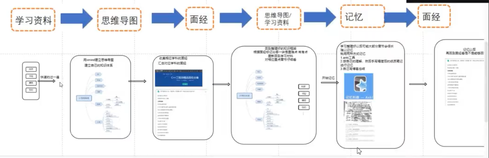
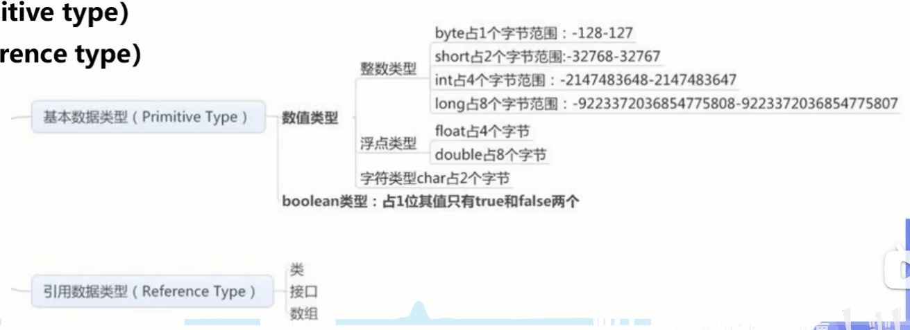
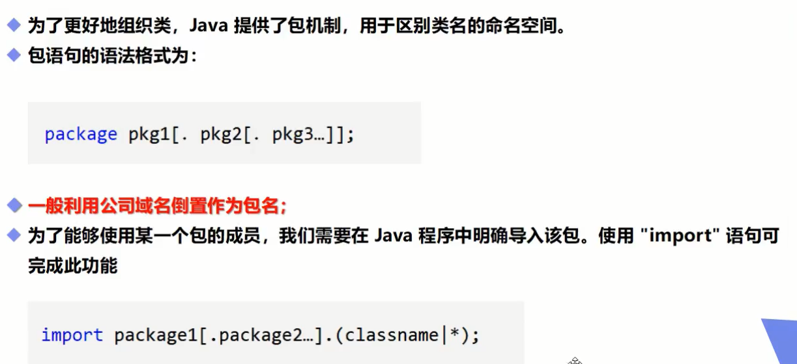

# 学习策略



## Java工程师精选面经集合


超链接地址： https://www.nowcoder.com/discuss/experience?tagId=639

面试宝典导读： https://www.nowcoder.com/tutorial/94/ea1986fcff294f6292385703e94689e8

# Java基础

## 1-基础

**1 、数据类型**

基本数据类型（八大）

**整型: byte（1字节:-128~127）、short（2字节）、int（4字节）、long(L)（8字节）**

**浮点型：float(F)（4字节）、double（8字节）**

**字符型: char（2字节）**

**布尔型: boolean（占1位）**

1Byte = 8bit

1KB = 1024B

1MB = 1024KB

1GB = 1024MB


引用数据类型:

**数组**

**类型**

**类（String类）**



**2、数据类型扩展**

整数扩展：二进制0b、十进制、八进制0、十六进制0x

浮点数扩展：BigDecimal类

char unicode 数字-字符   48-0  65-A  97-a    即: char c = '\u0061'


数据类型转换： **低到高 -> 自动类型提升**   **高到低 -> 强制类型转换** 


**3、变量和常量**

public class demo {

​		static int num; // 类变量  demo.num

​		int num;  // 成员变量  new demo().num

​		public void method() {

​        		int num; // 局部变量

​		}

}


常量一般大写，且用final修饰

final double PI =3.14


**变量的命名规范：**

①类成员变量和局部变量：首字母小写+驼峰原则 lastName

②常量：大写字母+下划线  MAX_VALUE

③类名：首字母大写+驼峰原则 Main

④方法名：首字母小写+驼峰原则 runRun()


**4、运算符**

①算术运算符：+，-，*，/，%，++，--

②赋值运算符：=

③关系运算符：>，<，>=，<=，==，!= ，instanceof

④逻辑运算符：&&，||，！（**短路运算**）

⑤位运算符：&（与），|（或），^（异或），~（非），>>（ 相当于/2），<<（相当于*2），>>>

\>>：带符号右移。正数右移高位补0，负数右移高位补1

\>>>：无符号右移。无论是正数还是负数，高位通通补0

⑥条件运算符：？:

⑦扩展赋值运算符：+=，-=，*=，、=

注意: +有时候表示字符串的拼接，a=10,b=20,  则""+a+b ->  1020 ， 而a+b+"" -> 30


**5、包机制**




**6、JavaDoc**

@author作者名		@version版本号		@since指明最早使用的jdk版本

@param参数名		@return返回值情况		@throws异常抛出情况

生存JavaDoc的命令：javadoc -encoding UTF-8 -charset UTF-8 test.java


7、Scanner类输入

```java
Scanner sc = new Scanner(System.in);
if (sc.hasNext()) {
	String str = sc.next();
}
```


**8、关于流程控制的补充**

```java
switch(expression) {
    case A:
        语句;
       	break;
    default:
        语句;
}
```


switch语句中的变量类型: byte 、short、int、char

JavaSE7 中 switch支持字符串String类型，case必须位字符串常量或字面量


循环中的九九乘法表


**9、方法的重载**

重载：在一个类中有相同的函数名称，但是形参不同的函数

规则：方法名相同，参数列表不同（个数，类型，参数排列顺序），但是返回类型不同不足以成为方法的重载。


可变参数： void test(int...i) 必须是参数的最后一个


**10、内存分析**


数组的三种初始化：

①静态初始化： int[] arr = {1, 2, 3};

②动态初始化：int[] arr = new int[3]; a[0] = 1

③数组默认初始化：数组是引用类型


Arrays工具类：

fill(nums, x)方法：nums数组填充x

toString()方法：打印数据元素

sort（）方法：数组排序

equals（）方法：比较数组中的元素值是否相等

查找数组元素：通过binarySearch（）方法堆排序好的数组进行二分查找

## 2-容器

## 3-并发编程

## 4-JVM

## 5-新特性

## 6-小技巧


# 计算机基础

## 1-计算机网络

### 概述

**网络的网络**

网络把主机连接起来，互联网把多种不同的网络连接起来，即互联网是网络的网络。

**ISP**

*Internet Service Provider*，互联网服务提供商，ISP分为第一层ISP,区域ISP和接入ISP。


**主机之间的通信方式**

客户-服务器（C/S）:客户是服务的请求方，服务器是服务的提供方

对等（P2P）：不区分客户和服务器

**电路交换与分组交换**

电路交换：电路交换用于电话通信系统，两个用户通信前先建立一条专用的物理链路，并且在整个通信过程中始终占有该链路，但是电路交换对线路的利用率很低。

分组交换：每个分组都含有首部和尾部，包含源地址和目的地址，在同一传输线路中可以同时传输多个分组

**（分组交换+存储转发）**

**时延**

总时延 = 传输时延 + 传播时延 + 排队时延 + 处理时延

① 排队时延

分组在路由器的输入队列和输出队列中排队等待的时间，取决于网络当前的通信量。

② 处理时延

主机或路由器收到分组时进行处理所需要的时间，例如分析首部、从分组中提取数据、进行差错检验或查找适当的路由等。

③ 传输时延

主机或路由器传输数据帧所需要的时间。


其中 l 表示数据帧的长度，v 表示传输速率。

④传播时延

电磁波在信道中传播所需要花费的时间，电磁波传播的速度接近光速。


其中 l 表示信道长度，v 表示电磁波在信道上的传播速度。


**计算机网络体系结构**


**① OSI七层模型**：

表示层：数据压缩、加密和数据描述，使得应用程序不必关系再各台主机中数据格式不同的问题。

会话层：建立以及管理会话。

**② 五层协议：**

应用层：为特定的程序提供数据传输服务，如HTTP、DNS等协议。**数据单位是报文。**

运输层：为进程提供数据传输服务（面向端口）。

TCP（传输控制协议），**数据单位是报文段**，面向有连接，可靠的数据传输服务，主要提供完整性服务；

UDP（用户数据报协议），**数据单位是用户数据报**，面向无连接，尽最大努力的数据传输服务，主要提供及时性服务。

网络层：为主机提供数据传输服务。但是传输层的协议是为主机中的进程提供数据传输服务。网络层把传输层的报文段或者用户数据报封装成分组。**数据单位是分组**，分组交换和存储转发。

数据链路层：主机之间可以有很多链路，链路层协议就是为同一链路的主机提供数据传输服务。数据链路层把网络层传下来的分组封装成帧。**数据单位是帧。**

物理层：如何再传输媒介上透明地传输比特流。**数据单位是比特流。**

**③ TCP/IP：**应用层、运输层、网际层、网络接口层

相当于五层协议中的数据链路层和物理层合并成为网络接口层。

TCP/IP 体系结构不严格遵循 OSI 分层概念，应用层可能会直接使用 IP 层或者网络接口层。


**④ 数据在各层之间的传输过程：**

向下过程中，需要添加下层协议所需要的首部或者尾部，向上的过程中，需要拆开首部和尾部。


路由器只有下三层协议，网络层，数据链路层和物理层，不需要为进程或者应用程序提供服务，所以不需要传输层和应用层。


### 物理层

### 链路层

### 网络层

### 传输层

### 应用层


## 2-操作系统


## 3-数据结构


## 4-算法


# 数据库


# 系统结构


# 分布式


# 高性能


# 高可用


# 简历模板


