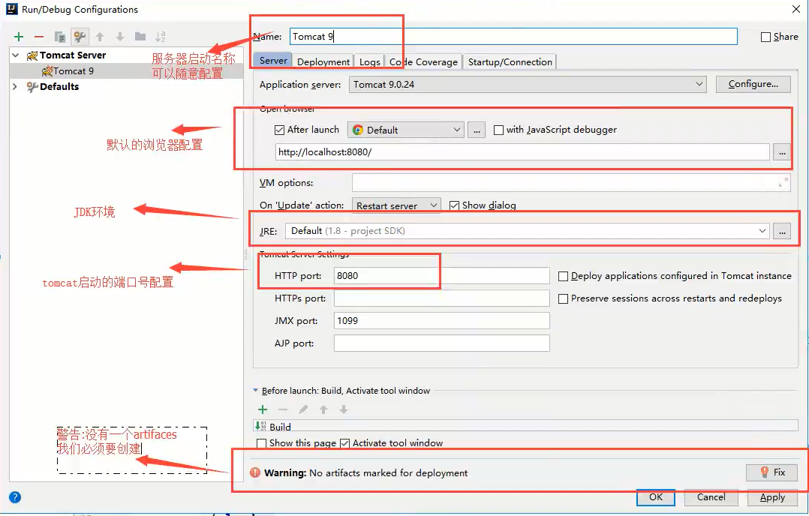
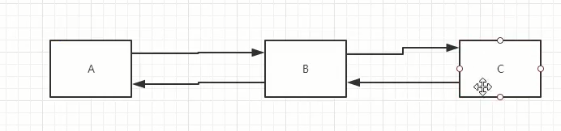
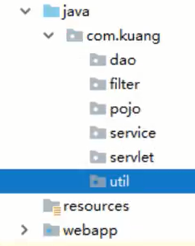
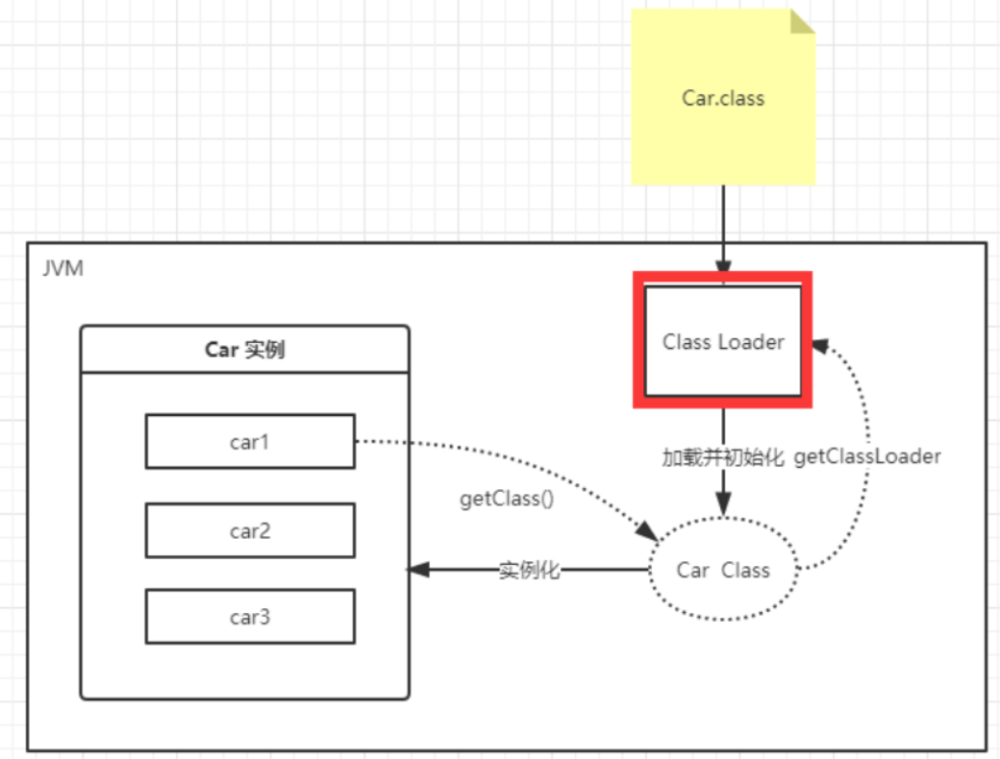
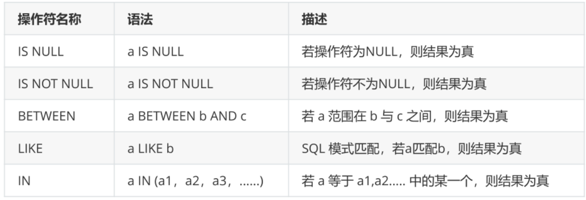

# 学习策略


## Java工程师精选面经集合


超链接地址： https://www.nowcoder.com/discuss/experience?tagId=639

面试宝典导读： https://www.nowcoder.com/tutorial/94/ea1986fcff294f6292385703e94689e8

# Java基础

## 1-基础

**1 、数据类型**

基本数据类型（八大）

**整型: byte（1字节:-128~127）、short（2字节）、int（4字节）、long(L)（8字节）**

**浮点型：float(F)（4字节）、double（8字节）**

**字符型: char（2字节）**

**布尔型: boolean（占1位）**

1Byte = 8bit

1KB = 1024B

1MB = 1024KB

1GB = 1024MB


引用数据类型:

**数组**

**类型**

**类（String类）**


**2、数据类型扩展**

整数扩展：二进制0b、十进制、八进制0、十六进制0x

浮点数扩展：BigDecimal类

char unicode 数字-字符   48-0  65-A  97-a    即: char c = '\u0061'


数据类型转换： **低到高 -> 自动类型提升**   **高到低 -> 强制类型转换** 


**3、变量和常量**

public class demo {

​		static int num; // 类变量  demo.num

​		int num;  // 成员变量  new demo().num

​		public void method() {

​        		int num; // 局部变量

​		}

}


常量一般大写，且用final修饰

final double PI =3.14


**变量的命名规范：**

①类成员变量和局部变量：首字母小写+驼峰原则 lastName

②常量：大写字母+下划线  MAX_VALUE

③类名：首字母大写+驼峰原则 Main

④方法名：首字母小写+驼峰原则 runRun()


**4、运算符**

①算术运算符：+，-，*，/，%，++，--

②赋值运算符：=

③关系运算符：>，<，>=，<=，==，!= ，instanceof

④逻辑运算符：&&，||，！（**短路运算**）

⑤位运算符：&（与），|（或），^（异或），~（非），>>（ 相当于/2），<<（相当于*2），>>>

\>>：带符号右移。正数右移高位补0，负数右移高位补1

\>>>：无符号右移。无论是正数还是负数，高位通通补0

⑥条件运算符：？:

⑦扩展赋值运算符：+=，-=，*=，、=

注意: +有时候表示字符串的拼接，a=10,b=20,  则""+a+b ->  1020 ， 而a+b+"" -> 30


**5、包机制**


**6、JavaDoc**

@author作者名		@version版本号		@since指明最早使用的jdk版本

@param参数名		@return返回值情况		@throws异常抛出情况

生存JavaDoc的命令：javadoc -encoding UTF-8 -charset UTF-8 test.java


7、Scanner类输入

```java
Scanner sc = new Scanner(System.in);
if (sc.hasNext()) {
	String str = sc.next();
}
```


**8、关于流程控制的补充**

```java
switch(expression) {
    case A:
        语句;
       	break;
    default:
        语句;
}
```


switch语句中的变量类型: byte 、short、int、char

JavaSE7 中 switch支持字符串String类型，case必须位字符串常量或字面量


循环中的九九乘法表


**9、方法的重载**

重载：在一个类中有相同的函数名称，但是形参不同的函数

规则：方法名相同，参数列表不同（个数，类型，参数排列顺序），但是返回类型不同不足以成为方法的重载。


可变参数： void test(int...i) 必须是参数的最后一个


**10、内存分析**


**11、数组的三种初始化：**

①静态初始化： int[] arr = {1, 2, 3};

②动态初始化：int[] arr = new int[3]; a[0] = 1

③数组默认初始化：数组是引用类型


Arrays工具类：

fill(nums, x)方法：nums数组填充x

toString()方法：打印数据元素

sort（）方法：数组排序

equals（）方法：比较数组中的元素值是否相等

查找数组元素：通过binarySearch（）方法堆排序好的数组进行二分查找


**12、值传递和引用传递**（实际是传递地址）

值传递：基础类型

引用传递：类、接口、数组


**13、构造器**

和类名相同，没有返回值 

new的本质是在调用构造器

定义了有参构造，如果使用无参构造，必须显示写出有参构造


**14、封装、继承、多态**

① 关于封装

高内聚，低耦合

属性私有private，通过get/set获取或设置

隐藏代码的实现细节，保证数据的安全性


② 关于继承

is a的关系

```java
public void test(String name) {
    System.out.println(name);
    System.out.println(this.name);
    System.out.println(super.name);
} 
```

super调用父类的构造方法，必须在构造方法中的第一个

super必须只能出现在子类的方法或构造方法中

super和this不能同时调用构造方法


super和this的区别

代表对象不同：

​		super表示父类对象的引用

​		this表示本身对象的调用

前提：

​		this 没有继承也可以使用

​		super 只能在继承条件中才可以使用

构造方法：

​		this（）本类的构造

​		super（）父类的构造


③ 关于多态

多态：父类的引用指向子类对象（方法的多态，不是属性的多态）

静态方法：方法的调用只和左边所定义的数据类型有关（类加载就出现）

非静态方法：先继承后重写 。编译看左（只能调用左边存在的方法），运行看右（有重写，执行重写的方法）


A extends B

A a = new A();

B a = new A(); // 多态

注意问题：

**1 父类可以指向子类，但是不能调用子类的方法**

**2 子类可以调用自己或者父类的方法**

**3 static 方法属于类，不属于实例， final 不能被修改， private方法**

④ 重写

注意点：

1 子类继承父类，子类重写父类方法，而且必须是方法名字相同,方法体不同

2 参数列表相同

3 修饰符和范围可以扩大： private -> public

4 抛出的异常范围可以缩小： Exception -> ClassNotFoundException


**15、instanceof方法**

判断一个对象是什么类型

instanceof （类型转换）


**16、关于代码的加载先后顺序**

```java
public class Demo {
    static {
        1 静态代码块（只执行一次）
    }
    {
        2 匿名代码块
    }
    public Demo() {
        3 构造方法代码块
    }
}
```

**17、抽象类和接口**

类单继承，接口可以多继承

抽象类：

1、子类继承，然后重写实现

2 、抽象类中可以写普通的方法，但是抽象方法必须在抽象类中


| 普通类 | 只有具体实现                                                 |
| ------ | ------------------------------------------------------------ |
| 抽象类 | 有具体实现和抽象方法                                         |
| 接口   | 只有抽象方法（属性是public static final和方法是public abstract） |

面向接口编程：约束和实现分离（能不能的问题）

**18、内部类**

① 成员内部类

```java
public class Outer {
    private int id = 10;
    public void out() {}
    
    public class Inner {
        public viod in() {}
        
        public void getID() {
            
        }
    }
}

psvm {
    Outer.Inner inner = new  Outer().new Inner();
}
```


② 局部内部类（方法内部定义）

```java
public class Outer {
    private int id = 10;
    public void out() {
        class Inner() {
            
        }
    }
}
```


③ 静态内部类

```java
public class Outer {
    private int id = 10;
    public void out() {}
    
    public static class Inner {
        public viod in() {}
        
        public void getID() {
            
        }
    }
}
```


④ 匿名内部类

**接口的匿名实现类的匿名对象**

**抽象类的匿名子类的匿名对象**

new Fly() {

​	@Override

​	public void test() {}

};

**19、异常类（异常Exception和错误Error  ）**

Error通常是虚拟机抛出的异常，一般程序是无法控制和处理的，Exception一般是程序可以处理的异常


处理：try、catch、finally、throw、throws

catch（想要捕获的类型）

finally （释放资源）

throw new Exception(); （主动抛出异常，一般在方法中使用）

throws (如果方法不能处理异常，那么在方法上使用)

## 2-容器

## 3-并发编程

## 4-JVM

## 5-新特性

## 6-小技巧

## 7-JavaWeb

### 1 基本概念 

#### 1.1 静态web和动态web

- 静态web： 提供给所有人的数据始终不变
- 动态web：会动态变化，技术栈使用servlet/jsp

**1.2 web应用程序**

- 可以供浏览器访问的程序

- 统一的web资源会放在同一个文件夹下，web应用程序 -> tomcat 服务器

- 包含：html/css/js、jsp/servlet、java程序、jar包、配置文件（properties）

  

动态web的特点是：

1 可以与数据库进行数据交换（数据持久化） 

2 web页面动态更新 

3 资源发生错误，需要重新编写后台程序，重新发布


### 2  web服务器

tomcat（服务器处理用户的一些请求或给出响应）

jsp/ servlet（B/S架构）在服务器上的程序


### 3 Tomcat

#### 3.1 tomcat启动 

cmd: catalina run

测试网站： localhost:8080

#### 3.2 tomcat配置

注意java环境变量配置 + 乱码问题-配置文件配置


#### 3.3 面试题：网站是如何访问的

```java
1 输入一个域名，回车
2 检查本机的C:\Windows\System32\drivers\etc\hosts配置文件下有没有该域名
    1）有，直接返回对应的ip地址，如localhost: 127.0.0.1
    2）没有,去远程dns服务器寻找，找到返回，否则不存在
```

#### 3.4发布一个web网站

放在tomcat指定的web应用文件夹（webapps）中

```java
网站的结构：
-webapps: tomcat服务器的web目录
    -ROOT
    -projectName: 项目目录名
        -WEB-INF
        	-classes: Java程序
            -lib: web应用所依赖的jar包
            -web.xml: 网站配置文件
        -index.html
        -static
            -css
            -js
            -img
```

#### 3.5 idea中配置tomcat





#### 3.6 关于添加Artifact中war和war exploded的区别

① war 模式：这种可以称之为是发布模式，看名字也知道，这是先打成war包，再发布；

② war exploded 热部署
  刚开始使用idea，发现工程每次修改JS或者是JSP页面后，并没有生效，每次修改都需要重启一次Tomcat才能体现刚刚所作的修改，这种方式浪费了自己很多时间，那么通过war exploded模式可以实现热部署，即每次修改代码后，不用重新启动tomcat即可实时显示自己代码修改后的效果。

③ 热部署方式相关设置
tomcat配置
		1）on ‘update‘ action：当用户主动执行更新的时候更新　　　　
  2）on frame deactication: 在编辑窗口失去焦点的时候更新
  3）你可以根据自己的需求进行设置，我这里两个都有设置，都设置成 Update classes and resources


servlet修改之后不更新的原因

F12打开开发者工具，选到network一栏，找到Disable cache 打钩，刷新就不会读缓存。


开启idea自动build功能（热部署）+ restart  tomcat服务器


#### 3.7 web-app没有小蓝点，无法创建Artifact


右键项目添加web框架，但是web目录和maven自动建立的不同


#### 3.8 8080端口被占用，无法启动tomcat

8080端口被占用，这时打开终端，输入netstat -aon|findstr "8080"查询是那个端口占用了，之后再输入taskkill /pid 端口号 /f，即可解决

### 4 Http

#### 4.1 http概念

hhtp是超文本传输协议

​	http: 80端口

​	https:423端口

#### 4.2 http的两个时间

​	HTTP/1.0: c和s连接一次只能获得一个web资源，断开连接

​	HTTP/2.0: c和s连接后，可以获得多个web资源

#### 4.3 Http请求

```java
Request URL: https://www.baidu.com/ 请求地址 
Request Method: GET    get/post方法
Status Code: 200 OK	   状态码 200
Remote Address: 14.215.177.38:443
```

```java
Accept:text/html
Accept-Encoding: gzip, deflate, br
Accept-Language: zh-CN,zh;q=0.9
Cache-Control: max-age=0
Connection: keep-alive
```

**请求行**

- 请求行中的请求方式：get

- 请求方式：get/post、head、delete、put、tract

  	- get：请求能携带的参数少，大小有限制，会在浏览器的url地址栏中显示数据，不安全，但高效
  	- post：请求能够携带的参数多，大小没有限制，不会再浏览器的url地址栏中显示数据，安全，但不高效


**消息头**

```java
Accept:text/html 	告诉浏览器，它所支持的数据类型
Accept-Encoding: 支持的编码 gbk utf-8  gb2312 iso8559-1
Accept-Language: zh-CN,zh;q=0.9	语言环境
Cache-Control: max-age=0	
Connection: keep-alive	请求完是断开还是连接
host		主机
```

#### 4.4 Http响应

```java
Cache-Control: private
Connection: keep-alive
Content-Encoding: gzip
Content-Type: text/html;charset=utf-8
```

**响应体**

```java
Accept:text/html 	告诉浏览器，它所支持的数据类型
Accept-Encoding: 支持的编码 gbk utf-8  gb2312 iso8559-1
Accept-Language: zh-CN,zh;q=0.9	语言环境
Cache-Control: max-age=0	
Connection: keep-alive	请求完是断开还是连接
host		主机
refresh: 告诉客户端，多久刷新一次
location: 让网页定位
```


**响应状态码**

200	请求响应成功

404	找不到资源

3**	请求重定向

500	服务器代码错误

502	网关错误

常见面试题：当地址栏输入地址并回车到页面显示经历了什么？


### 5 Maven

maven自动导入和配置jar包的工具

#### 5.1 Maven项目架构管理工具（方便导入jar包）

核心思想：约定大于配置

#### 5.2 下载安装和配置maven

1 环境变量配置

- M2_HOME   maven目录下的bin目录

- MAVEN_HOME  maven的目录
- 在系统的path中配置 %MAVEN_HOME%\bin
- win10系统，环境变量显示长条而不是列表形式
  修改环境变量，第一个不要使用%%这种路径，保存后重新打开，就会发现以列表形式显示了
- mvn -v   命令查看是否安装成功


​	


2 中央仓库配置


#### 5.3 阿里云镜像

```xml
// 配置阿里云防止被墙
<mirrors>
    <mirror>  
	    <id>alimaven</id>  
      <name>aliyun maven</name>  
      <url>http://maven.aliyun.com/nexus/content/groups/public/</url>
      <mirrorOf>*,!jeecg,!jeecg-snapshots</mirrorOf> 
     //如果不加，默认所有的依赖都会去阿里云仓库下载，加上后jeecg的依赖包就可以从jeecg私服下载了。
     // <mirrorOf>central</mirrorOf>        
    </mirror>	
	
    <mirror>
      <id>repo2</id>
      <name>repo2 maven</name>
      <url>http://repo2.maven.org/maven2/</url>
	    <mirrorOf>central</mirrorOf>
    </mirror>
 </mirrors>
```

#### 5.4 idea配置maven

1 创建maven web项目


2 等待项目初始化完毕


3 idea中的maven设置


4 创建普通maven项目

什么都不用选


#### 5.5 标记文件夹的功能

方式一：


方式二：


#### 5.6 pom文件 

pom.xml是maven的核心配置文件


#### 5.7 Maven资源导出问题

（maven由于他的约定大于配置，我们之后可能会遇到写的配置文件无法被导出或者生效的问题，解决方案如下）

**在build中配置resources节点，防止资源导出失败的问题**

```xml
<build>
    .......
      <resources>
        <resource>
            <directory>src/main/resources</directory>
            <excludes>
                <exclude>**/*.properties</exclude>
                <exclude>**/*.xml</exclude>
             </excludes>
            <filtering>false</filtering>
        </resource>
        <resource>
            <directory>src/main/java</directory>
            <includes>
                <include>**/*.properties</include>
                <include>**/*.xml</include>
            </includes>
            <filtering>false</filtering>
        </resource>
    </resources>
    ......
</build>
```


#### 5.8 idea生成jar包关系树


#### 5.9 maven遇到的问题

1 maven 3.6.2 出现unable to import maven project see logs for details

​	降级maven的版本

2 tomcat闪退

3 idea每次都要重新配置maven

全局设置maven的xml配置和本地的仓库


4 maven项目中tomcat无法配置

5 maven默认的web项目的web.xml的版本问题

在webapp目录下的web.xml改为使用tomcat的ROOT目录下的web.xml的4.0版本最为和tomcat兼容

6 maven仓库的使用

https://mvnrepository.com/


找到多人用的，然然后删除作用域，在pom.xml中添加依赖


7 idea自动导入maven

手动设置，File → Settings → Importing → Import [Maven](https://so.csdn.net/so/search?q=Maven&spm=1001.2101.3001.7020) projects automatically → OK。 


### 6 Servlet

#### 6.1 Servlet介绍

动态web技术，开发Servlet程序，先实现servlet接口，然后把该类部署在web服务器中

把实现了servlet接口的java程序叫做servlet

#### 6.2 helloServlet

1 构建一个普通maven项目，删除src，然后在空的工程放新的module

2 关于maven父子工程的理解

父项目

```xml
<modules>
    <module>servlet-01</module>
</modules>
```

子项目

```xml
<parent>
    <artifactId>javaweb-02-servlet</artifactId>
    <groupId>com.ljw</groupId>
    <version>1.0-SNAPSHOT</version>
</parent>
```

3 maven环境的优化 

① 把子项目的webapp中的web.xml更新（tomcat中ROOT中的）

② 将maven的结构搭建完整： 添加java目录和resources目录

4 编写一个servlet

​	① 编写一个普通类

​	② 实现servlet接口，这里继承httpservlet

​			重写doGet和doPost方法

5 在webapp文件夹中web.xml编写servlet的映射

浏览器访问web服务器，需要在web服务器中注册servlet,和浏览器能够访问的路径

```xml
<!--注册servlet程序-->
<servlet>
    <servlet-name>helloServlet</servlet-name>
    <servlet-class>com.ljw.servlet.HelloServlet</servlet-class>
</servlet>
<!--servlet程序映射-->
<servlet-mapping>
    <servlet-name>helloServlet</servlet-name>
    <url-pattern>/helloServlet</url-pattern>
</servlet-mapping>
```

6 配置tomcat


#### 6.3 servlet的原理


#### 6.4 Mapping问题

① 一个servlet指定一个映射路径

```xml
<servlet-mapping>
    <servlet-name>helloServlet</servlet-name>
    <url-pattern>/helloServlet</url-pattern>
</servlet-mapping>
```

② 一个servlet可以指定多个映射路径

```xml
<servlet-mapping>
    <servlet-name>helloServlet</servlet-name>
    <url-pattern>/h1</url-pattern>
</servlet-mapping>
<servlet-mapping>
    <servlet-name>helloServlet</servlet-name>
    <url-pattern>/h2</url-pattern>
</servlet-mapping>
```

③ 一个servlet指定通用的映射路径

```xml
<servlet-mapping>
    <servlet-name>helloServlet</servlet-name>
    <url-pattern>/h1/*</url-pattern>
</servlet-mapping>
```

④ 一个servlet指定默认请求路径（一般不用）

没有了index，直接访问该servlet程序

```xml
<servlet-mapping>
    <servlet-name>helloServlet</servlet-name>
    <url-pattern>/*</url-pattern>
</servlet-mapping>
```

⑤ 自定义后缀实现请求映射

```xml
<servlet-mapping>
    <servlet-name>helloServlet</servlet-name>
    <url-pattern>*.do</url-pattern>
</servlet-mapping>
```

注意：指定的默认映射的优先级别最高，如果没有则是默认的

#### 6.5 servletContext对象


web容器启动时，为每个web程序创建一个对应的servletContext对象，每一个对应一个web应用

- **1 共享数据：servlet之间共享数据**

  ```java
  // servlet上下文 防止数据  a.servlet
  ServletContext context = this.getServletContext(); 
  String username = "abc";
  context.setAttribute("username", username);
  
  // b.servlet
  ServletContext context = this.getServletContext();
  String username = (String) context.getAttribute("username");
  
  resp.setContentType("text/html");
  resp.setCharacterEncoding("utf-8");
  resp.getWriter().println("username: " + username);
  ```

- **2 获取初始化数据**

  ```java
  // 获得初始化参数 a.servlet
  String url = context.getInitParameter("url");
  
  // xml
  <!--配置一些web应用的参数-->
  <context-param>
       <param-name>url</param-name>
       <param-value>jdbc:mysql://localhost:3306/mybatis</param-value>
  </context-param>
      
  ```

- **3 请求转发**

  请求转发：地址不变

  

  重定向：地址发生变化

  

  ```java
  ServletContext context = this.getServletContext();
     context.getRequestDispatcher("/helloServlet").forward(req, resp);
  ```

- **4  读取资源文件**

  properties

  - 在java目录下新建properties

  - 在resources目录下新建properties

    发现：都被打包在同一路径下：classes，即俗称的classpath

  注意问题：maven资源导出问题

  

  在maven clean 和install之后，target中java包中的资源没有生成导出

  

  解决方法：

  ```xml
  // web.xml
  <build>
        <resources>
          <resource>
              <directory>src/main/resources</directory>
              <excludes>
                  <exclude>**/*.properties</exclude>
                  <exclude>**/*.xml</exclude>
               </excludes>
              <filtering>false</filtering>
          </resource>
          <resource>
              <directory>src/main/java</directory>
              <includes>
                  <include>**/*.properties</include>
                  <include>**/*.xml</include>
              </includes>
              <filtering>false</filtering>
          </resource>
      </resources>
  </build>
  ```

  获取资源：创建文件流

  ```java
  InputStream is = this.getServletContext().getResourceAsStream("/WEB-INF/classes/db.properties");
  Properties pros = new Properties();
  pros.load(is);
  
  String username = pros.getProperty("username");
  String password = pros.getProperty("password");
  
  resp.getWriter().println(username + " " + password);
  ```

#### 6.6 HttpServletResponse

 web服务器接收到客户端请求，分别创建一个代表请求的httpServletRequest对象和代表响应的httpServletResponse对象

- 如果想获取请求过来的参数：找httpServletRequest

- 如果像给客户端响应一些信息：找httpServletResponse

**1 简单分类**

- 负责像浏览器发送数据的方法

  ```java
  ServletOutputStream getOutputStream() throws IOException;
  
  PrintWriter getWriter() throws IOException;
  ```

- 负责像浏览器发送响应头的方法

  ```java
  void setCharacterEncoding(String var1);
  
  void setContentLength(int var1);
  
  void setContentLengthLong(long var1);
  
  void setContentType(String var1);
  
  void setDateHeader(String var1, long var2);
  
  void addDateHeader(String var1, long var2);
  
  void setHeader(String var1, String var2);
  
  void addHeader(String var1, String var2);
  
  void setIntHeader(String var1, int var2);
  
  void addIntHeader(String var1, int var2);
  ```
  
- 响应的状态码

  ```java
  int SC_CONTINUE = 100;
  int SC_SWITCHING_PROTOCOLS = 101;
  int SC_OK = 200;
  int SC_CREATED = 201;
  int SC_ACCEPTED = 202;
  int SC_NON_AUTHORITATIVE_INFORMATION = 203;
  int SC_NO_CONTENT = 204;
  int SC_RESET_CONTENT = 205;
  int SC_PARTIAL_CONTENT = 206;
  int SC_MULTIPLE_CHOICES = 300;
  int SC_MOVED_PERMANENTLY = 301;
  int SC_MOVED_TEMPORARILY = 302;
  int SC_FOUND = 302;
  int SC_SEE_OTHER = 303;
  int SC_NOT_MODIFIED = 304;
  int SC_USE_PROXY = 305;
  int SC_TEMPORARY_REDIRECT = 307;
  int SC_BAD_REQUEST = 400;
  int SC_UNAUTHORIZED = 401;
  int SC_PAYMENT_REQUIRED = 402;
  int SC_FORBIDDEN = 403;
  int SC_NOT_FOUND = 404;
  int SC_METHOD_NOT_ALLOWED = 405;
  int SC_NOT_ACCEPTABLE = 406;
  int SC_PROXY_AUTHENTICATION_REQUIRED = 407;
  int SC_REQUEST_TIMEOUT = 408;
  int SC_CONFLICT = 409;
  int SC_GONE = 410;
  int SC_LENGTH_REQUIRED = 411;
  int SC_PRECONDITION_FAILED = 412;
  int SC_REQUEST_ENTITY_TOO_LARGE = 413;
  int SC_REQUEST_URI_TOO_LONG = 414;
  int SC_UNSUPPORTED_MEDIA_TYPE = 415;
  int SC_REQUESTED_RANGE_NOT_SATISFIABLE = 416;
  int SC_EXPECTATION_FAILED = 417;
  int SC_INTERNAL_SERVER_ERROR = 500;
  int SC_NOT_IMPLEMENTED = 501;
  int SC_BAD_GATEWAY = 502;
  int SC_SERVICE_UNAVAILABLE = 503;
  int SC_GATEWAY_TIMEOUT = 504;
  int SC_HTTP_VERSION_NOT_SUPPORTED = 505;
  ```
  

**2 常用应用**

1 向浏览器输出信息

2 下载文件

```java
// 1 获取路径
//        String realPath = this.getServletContext().getRealPath("");
String realPath = "F:\\project\\Java\\JavaWeb\\javaweb-02-servlet\\servlet-01\\target\\classes\\my.jpg";
System.out.println(realPath);

// 2 下在文件是什么
String fileName = realPath.substring(realPath.lastIndexOf("\\"));

// 3 设置浏览器支持下载文件
resp.setHeader("Content-disposition", "attachment; filename="+ URLEncoder.encode(fileName, "utf-8"));

// 4 获取下载文件的输入流
FileInputStream in = new FileInputStream(realPath);

// 5 创建缓冲区
int len = 0;
byte[] buffer = new byte[1024];

// 6 获取outputStream对象
ServletOutputStream out = resp.getOutputStream();

// 7 将FileOutputStream流写入buffer缓冲区
while ((len = in.read(buffer))!= -1) {
    out.write(buffer, 0, len);
}
in.close();
out.close();
```

**3 验证码功能**

- 前端实现

- 后端实现：需要java图片类

  ```java
  //如何让浏览器3秒自动刷新一次;
  resp.setHeader("refresh", "3");
  //在内存中创建一个图片
  BufferedImage image = new BufferedImage(80, 20, BufferedImage.TYPE_INT_RGB);
  //得到图片
  Graphics2D g = (Graphics2D) image.getGraphics(); //笔
  //设置图片的背景颜色
  g.setColor(Color.white);
  g.fillRect(0, 0, 80, 20);
  //给图片写数据
  g.setColor(Color.BLUE);
  g.setFont(new Font(null, Font.BOLD, 20));
  g.drawString(makeNum(), 0, 20);
  resp.setContentType("image/jpeg");
  //网站存在缓存，不让浏览器缓存
  resp.setDateHeader("expires", -1);
  resp.setHeader("Cache-Control", "no-cache");
  resp.setHeader("Pragma", "no-cache");
  //把图片写给浏览器
  ImageIO.write(image, "jpg", resp.getOutputStream());
  ```

**4  实现重定向**


B一个web资源收到客户端A请求后，B他会通知A客户端去访问另外一个web资源C，这个过程叫重定向

- 登录注册

  ```java
  void sendRedirect(String var1) throws IOException;
  /**
  * 相当于
  * resp.setHeader("Location","/r/img");
  * resp.setStatus(302);
  */
  resp.sendRedirect("/servlet01/imageRandom");
  ```

  

  

  ```html
  // action中的${pageContext.request.contextPath}为当前项目路径
  <form action="${pageContext.request.contextPath}/login" method="get">
      用户名：<input type="text" name="username"><br>
      密码： <input type="password" name="password">
      <input type="submit">
  </form>
  ```

  

#### 6.7 HttpServletRequest

httpServlet代表客户端的请求，用户通过http协议访问服务器


1 获取前端传递的参数


2 请求转发

注意：请求转发和重定向中/的区别

```java
// 请求转发中 / 表示当前工程目录, 重定向并不是,req.getContextPath()才是
resp.sendRedirect(req.getContextPath() + "/imageRandom");
req.getRequestDispatcher("/success.jsp").forward(req, resp);
```

面试题：重定向和请求转发的区别

相同点：都会发生页面的跳转

不同点：请求转发的时候，url不会发生变化	307

​				重定向会发生url变化	302

#### 6.8 cookie

**1 会话**

会话：用户打开一个浏览器，点击了很多超链接，访问多个web资源，关闭浏览器，这个过程可以称之
为会话；

cookie和session的区别：

1. 服务端给客户端一个 信件，客户端下次访问服务端带上信件就可以了； cookie
2. 服务器登记你来过了，下次你来的时候我来匹配你； seesion

**2 cookie常用方法**

```java
Cookie[] cookies = req.getCookies(); //获得Cookie
cookie.getName(); //获得cookie中的key
cookie.getValue(); //获得cookie中的vlaue
new Cookie("lastLoginTime", System.currentTimeMillis()+""); //新建一个cookie
cookie.setMaxAge(24*60*60); //设置cookie的有效期
resp.addCookie(cookie); //响应给客户端一个cookie
```

**3 关于cookie的细节**

- cookie：一般会保存在本地的 用户目录下 appdata；
- 一个web站点可以给浏览器发送多个cookie，最多存放20个cookie；
- Cookie大小有限制4kb；
- 300个cookie浏览器上限

**4 删除Cookie**

- 不设置有效期，关闭浏览器，自动失效
- 设置有效期时间为 0 

**5 解决乱码问题**

- 请求和响应

  ```java
  req.setCharacterEncoding("utf-8");
  resp.setCharacterEncoding("utf-8");
  resp.setContentType("text/html;charset=UTF-8"); // 告诉浏览器编码方式
  ```

- cookie的乱码

  ```java
  Cookie cookie = new Cookie("name", URLEncoder.encode("蓝", "utf-8"))
  resp.getWriter().write(URLDecoder.decode(cookie.getValue(), "utf-8"))
      
  URLEncoder.encode("蓝","utf-8")
  URLDecoder.decode(cookie.getValue(),"UTF-8")
  ```

**6.9 session**(sessionId唯一获取一个session会话)

**1 Session和cookie的区别：**

- Cookie是把用户的数据写给用户的浏览器，浏览器保存 （可以保存多个）

- Session把用户的数据写到用户独占Session中，服务器端保存 （保存重要的信息，减少服务器资
  源的浪费）

- Session对象由服务创建；

  

  HttpSession对象的方法


context和session都可以跨servlet的

**2 手动注销session**

```java
HttpSession session = req.getSession();
session.removeAttribute("name");
session.invalidate();
```

**3 web.xml注销session**

```xml
<!--设置Session默认的失效时间-->
<session-config>
  <!--15分钟后Session自动失效，以分钟为单位-->
  <session-timeout>15</session-timeout>
</session-config>
```

**4 使用场景**

- 保存一个登录用户的信息
- 购物车信息
- 在整个网站中经常会使用的数据，我们将它保存在Session中

### 7 Jsp

#### 7.1 Jsp介绍

jsp: java server pages： java服务器端页面

区别：

- html提供静态数据
- jsp可以嵌入java代码

#### 7.2 Jsp原理

服务器内部工作
tomcat中有一个work目录；
IDEA中使用Tomcat的会在IDEA的tomcat中生产一个work目录

- 发现jsp页面转变成java程序，即浏览器向服务器发送请求，不管访问什么资源，其实都是在访问Servlet！
- JSP最终也会被转换成为一个Java类！
- JSP 本质上就是一个Servlet


#### 7.3 jsp表达式

<%%>
<%=%>
<%!%>
<%--注释--%>

```jsp
<%--JSP表达式
 作用：用来将程序的输出，输出到客户端
 <%= 变量或者表达式%>
--%>
<%= new java.util.Date()%>
```

#### 7.4 jsp脚本片段

```jsp
<%--JSP表达式
 作用：用来将程序的输出，输出到客户端
 <%= 变量或者表达式%>
--%>
<%= new java.util.Date()%>
```

#### 7.5 jsp声明

```jsp
<%--JSP表达式
 作用：用来将程序的输出，输出到客户端
 <%= 变量或者表达式%>
--%>
<%= new java.util.Date()%>
```

#### 7.6 jsp指令

```jsp
<%@page args.... %>

对于变量
<%@include file=""%>
<%--@include会将两个页面合二为一--%>
<%@include file="common/header.jsp"%>
<h1>网页主体</h1>
<%@include file="common/footer.jsp"%>

<hr>
<%--jSP标签
  jsp:include：拼接页面，本质还是三个
  --%>

<jsp:include page="/common/header.jsp"/>
<h1>网页主体</h1>
<jsp:include page="/common/footer.jsp"/>
```

错误页面

```xml
// web.xml
<error-page>
    <error-code>404</error-code>
    <location>/error/404.jsp</location>
</error-page>
```


```jsp
// abc.jsp
<%@ page errorPage="/error/500.jsp" %>
```

#### 7.7 九大内置对象

PageContext 存东西
Request 存东西
Response
Session 存东西
Application 【SerlvetContext】 存东西
config 【SerlvetConfig】
out
page ，不用了解
exception

```java
pageContext.setAttribute("name1","1号"); //保存的数据只在一个页面中有效
request.setAttribute("name2","2号"); //保存的数据只在一次请求中有效，请求转发会携
带这个数据
session.setAttribute("name3","3号"); //保存的数据只在一次会话中有效，从打开浏览器
到关闭浏览器
application.setAttribute("name4","4号");  //保存的数据只在服务器中有效，从打开服
务器到关闭服务器
```

#### 7.8 Jsp标签、Jstl标签、EL表达式

1 pom.xml依赖

```xml
<!-- JSTL表达式的依赖 -->
<dependency>
  <groupId>javax.servlet.jsp.jstl</groupId>
  <artifactId>jstl-api</artifactId>
  <version>1.2</version>
</dependency>
<!-- standard标签库 -->
<dependency>
  <groupId>taglibs</groupId>
  <artifactId>standard</artifactId>
  <version>1.1.2</version>
</dependency>
```

2 EL表达式 ${ }

- 获取数据
- 执行运算
- 获取web开发的常用对象

3 jsp标签

```xml
<%--jsp:include--%>
<%--
http://localhost:8080/jsptag.jsp?name=kuangshen&age=12
--%>
<jsp:forward page="/jsptag2.jsp">
  <jsp:param name="name" value="kuangshen"></jsp:param>
  <jsp:param name="age" value="12"></jsp:param>
</jsp:forward
```

4 jstl标签

JSTL标签库的使用就是为了弥补HTML标签的不足；它自定义许多标签，可以供我们使用，标签的功能和
Java代码一样

**格式化标签**、**SQL标签**、**XML 标签**、**核心标签 （掌握部分）**


jstl使用方式：

- 引入库：<%@ taglib prefix="c" uri="http://java.sun.com/jsp/jstl/core" %>
- 使用其中的方法
- tomcat中pom引入包

### 8 JavaBean

JavaBean就是实体类

- 有一个无参构造
- 属性私有化
- 有set/get方法

ORM-对象关系映射：

- 类->表
- 属性->字段
- 对象->行记录

### 9 MVC框架

#### 9.1 之前时代


#### 9.2 之后时代(三层MVC架构)


**Model**

- 业务处理 ：业务逻辑（Service）
- 数据持久层：CRUD （Dao）

**View**

- 展示数据

- 提供链接发起Servlet请求 （a，form，img…）


**Controller （Servlet）**

- 接收用户的请求 ：（req：请求参数、Session信息….）
-   交给业务层处理对应的代码
-   控制视图的跳转

### 10 Filter过滤器

1 开发filter

- 导包


- 编写过滤器

```java
public void doFilter(ServletRequest req, ServletResponse resp, FilterChain filterChain) throws IOException, ServletException {
    req.setCharacterEncoding("utf-8");
    resp.setCharacterEncoding("utf-8");
    resp.setContentType("text/html;charset=UTF-8");
    System.out.println("执行前");
    filterChain.doFilter(req, resp);
    System.out.println("执行后");
}
```

- web.xml配置filter

```xml
<filter>
    <filter-name>CharacterEncodingFilter</filter-name>
    <filter-class>com.ljw.filter.CharacterEncodingFilter</filter-class>
</filter>
<filter-mapping>
    <filter-name>CharacterEncodingFilter</filter-name>
    <url-pattern>/servlet/*</url-pattern>
</filter-mapping>
```

2 应用：写一个权限过滤器（不能直接访问登录后的页面）

用户登录之后才能进入主页！用户注销后就不能进入主页了！

- 用户登录之后，向Sesison中放入用户的数据
- 进入主页的时候要判断用户是否已经登录；要求：在过滤器中实现

```java
HttpServletRequest request = (HttpServletRequest) req;
HttpServletResponse response = (HttpServletResponse) resp;
if (request.getSession().getAttribute(Constant.USER_SESSION)==null){
  response.sendRedirect("/error.jsp");
}
chain.doFilter(request,response);
```


### 11 listener监听器

- 编写监听器

```java
public void sessionCreated(HttpSessionEvent se) {
    ServletContext servletContext = se.getSession().getServletContext();
    Integer onlineCount = (Integer) servletContext.getAttribute("OnlineCount");
    if (null == onlineCount) {
        onlineCount = new Integer(1);
    } else {
        int cnt = onlineCount.intValue();
        onlineCount = new Integer(cnt + 1);
    }
    servletContext.setAttribute("onlineCount", onlineCount);
}
```

- web.xml注册监听器

```xml
<listener>
    <listener-class>com.ljw.listener.OnlineCountListener</listener-class>
</listener>
```

- 销毁session

自动销毁

```xml
<session-config>
    <session-timeout>1</session-timeout>
</session-config>
```

手动销毁

```java
getSession().invalidate();
```

### 12 jdbc

1 配置与连接

````java
//配置信息
//useUnicode=true&characterEncoding=utf-8 解决中文乱码
String url = "jdbc:mysql://localhost:3306/jdbcTest?useUnicode=true&characterEncoding=utf-8&useSSL=false";
String username = "root";
String password = "root";

// 1 加载驱动
Class.forName("com.mysql.jdbc.Driver");
// 2 连接数据库
Connection connection = DriverManager.getConnection(url, username, password);
// 3 编写sql语句
String sql = "insert into users(id, name, password, email,\n" +
    "birthday) values (?,?,?,?,?);";
// 4 预编译
PreparedStatement ps = connection.prepareStatement(sql);
ps.setInt(1, 2);
ps.setString(2, "msc");
ps.setString(3, "root");
ps.setString(4, "qq@qq.com");
ps.setDate(5, new Date(new java.util.Date().getTime()));

// 5 执行sql
int i = ps.executeUpdate();
if (i > 0) {
    System.out.println("插入成功");
}
ps.close();
connection.close();


ResultSet rs = ps.executeQuery(sql);
while (rs.next()) {
    System.out.println(rs.getObject("id"));
    System.out.println(rs.getObject("name"));
    System.out.println(rs.getObject("password"));
    System.out.println(rs.getObject("email"));
    System.out.println(rs.getObject("birthday"));
    System.out.println();
}
````

2 关于事务

```xml
开启事务
事务提交 commit()
事务回滚 rollback()
关闭事务

try {
	connection.setAutoCommit(false);
	excute();
    connection.commit();
} catch() {
    connection.rollback()
} finaly {
    connection.close();
}
```

### 13 项目搭建

1 搭建maven web项目

2 配置tomcat  web.xml 4.0

3 pom.xml 中的jar包

jsp、servlet、mysql、jstl、stand驱动等

4 创建项目的包结构

5 创建数据库

6 编写实体类 orm映射



7 编写基础公共类

resources

​	- db.properties

1 数据库配置文件

```xml
driver=com.mysql.jdbc.Driver
url=jdbc:mysql://localhost:3306/jdbcTest?useUnicode=true&characterEncoding=utf-8&useSSL=false
username=root
password=root
```

2 数据操作的公共类

```java
public class BaseDao {
    private static String driver;
    private static String url;
    private static String username;
    private static String password;

    // 静态代码块、类加载
    static {
        // 通过类加载器读取对应资源
        InputStream is = BaseDao.class.getClassLoader().getResourceAsStream("db.properties");
        Properties properties = new Properties();
        try {
            properties.load(is);
        } catch (IOException e) {
            e.printStackTrace();
        }
        driver = properties.getProperty("driver");
        url = properties.getProperty("url");
        username = properties.getProperty("username");
        password = properties.getProperty("password");
    }

    // 获取数据库的连接
    public static Connection getConnection() {
        Connection connection = null;
        try {
            Class.forName(driver);
            connection = DriverManager.getConnection(url, username, password);
        } catch (Exception e) {
            e.printStackTrace();
        }
        return connection;
    }

    // 编写查询
    public static ResultSet excute(Connection connection, String sql, Object[] params, PreparedStatement ps, ResultSet rs) throws SQLException {
        ps = connection.prepareStatement(sql);
        for (int i = 0; i < params.length; i ++ ) {
            ps.setObject(i + 1, params[i]);
        }
        rs = ps.executeQuery();
        return rs;
    }

    // 编写增删改
    public static int excute(Connection connection, String sql, Object[] params, PreparedStatement ps) throws SQLException {
        ps = connection.prepareStatement(sql);
        for (int i = 0; i < params.length; i ++ ) {
            ps.setObject(i + 1, params[i]);
        }
        int updateRows = ps.executeUpdate();
        return updateRows;
    }

    // 关闭资源
    public static boolean closeResource(Connection connection, PreparedStatement ps, ResultSet rs) {
        boolean flag = true;
        if (rs != null) {
            try {
                rs.close();
                flag = false;
            } catch (SQLException e) {
                e.printStackTrace();
            }
        }
        if (ps != null) {
            try {
                ps.close();
                flag = false;
            } catch (SQLException e) {
                e.printStackTrace();
            }
        }
        if (connection != null) {
            try {
                connection.close();
                flag = false;
            } catch (SQLException e) {
                e.printStackTrace();
            }
        }
        return flag;
    }
}
```

3 编写字符过滤器

```xml
<filter>
    <filter-name>CharacterEncodingFilter</filter-name>
    <filter-class>com.project.filter.CharacterEncodingFilter</filter-class>
</filter>
<filter-mapping>
    <filter-name>CharacterEncodingFilter</filter-name>
    <url-pattern>/*</url-pattern>
</filter-mapping>
```

```java
public void doFilter(ServletRequest req, ServletResponse resp, FilterChain filterChain) throws IOException, ServletException {
    req.setCharacterEncoding("utf-8");
    resp.setCharacterEncoding("utf-8");
    resp.setContentType("text/html;charset=UTF-8");
    filterChain.doFilter(req, resp);
}
```

4 druid连接

```java
private static DataSource dataSource;

    static {
        InputStream is = ClassLoader.getSystemClassLoader().getResourceAsStream("druid.properties");
        Properties pros = new Properties();
        try {
            pros.load(is);
            dataSource = DruidDataSourceFactory.createDataSource(pros);
        } catch (Exception e) {
            e.printStackTrace();
        }
    }

    public static Connection getConnection() {
        Connection conn = null;
        try {
            conn = dataSource.getConnection();
        } catch (SQLException e) {
            e.printStackTrace();
        }
        return conn;
    }

    public static void closeResources(Connection conn, PreparedStatement pstm, ResultSet rs) {
        if (conn != null) {
            try {
                conn.close();
            } catch (SQLException e) {
                e.printStackTrace();
            }
        }

        if (pstm != null) {
            try {
                pstm.close();
            } catch (SQLException e) {
                e.printStackTrace();
            }
        }

        if (rs != null) {
            try {
                rs.close();
            } catch (SQLException e) {
                e.printStackTrace();
            }
        }
    }
```

druid.properties

```xml
driverClassName=com.mysql.jdbc.Driver
url=jdbc:mysql://localhost:3306/test
username=root
password=root
```

5 jdbc连接

```java
	private static String driver;
    private static String url;
    private static String username;
    private static String password;

    static {
        InputStream is = JDBCUtils.class.getClassLoader().getResourceAsStream("db.properties");
        Properties pros = new Properties();
        try {
            pros.load(is);
        } catch (IOException e) {
            e.printStackTrace();
        }
        driver = pros.getProperty("driver");
        url = pros.getProperty("url");
        username = pros.getProperty("username");
        password = pros.getProperty("password");
    }

    public static Connection getConnection() {
        Connection conn = null;
        try {
            Class.forName(driver);
            try {
                conn = DriverManager.getConnection(url, username, password);
            } catch (SQLException e) {
                e.printStackTrace();
            }
        } catch (ClassNotFoundException e) {
            e.printStackTrace();
        }
        return conn;
    }

    public static void closeResource(Connection conn, PreparedStatement pstm, ResultSet rs) {
        if (conn != null) {
            try {
                conn.close();
            } catch (SQLException e) {
                e.printStackTrace();
            }
        }

        if (pstm != null) {
            try {
                pstm.close();
            } catch (SQLException e) {
                e.printStackTrace();
            }
        }

        if (rs != null) {
            try {
                rs.close();
            } catch (SQLException e) {
                e.printStackTrace();
            }
        }
    }
```

db.properties

```xml
driver=com.mysql.jdbc.Driver
url=jdbc:mysql://localhost:3306/jdbcTest?useUnicode=true&characterEncoding=utf-8&useSSL=false
username=root
password=root
```

6 BaseDao

```java
public abstract class BaseDao<T> {
    private Class<T> clazz = null;

    /* ！为了获取BaseDao的子类继承父类中泛型 ！*/ {  // 为了避免每个实现子列写一份，所以写在父类中，相当于父类this
        // 实际上new子类对象时是使用子类的this
        // 当前类->带泛型的父类
        Type genericSuperclass = this.getClass().getGenericSuperclass();
        ParameterizedType parmType = (ParameterizedType) genericSuperclass;
        Type[] types = parmType.getActualTypeArguments();// 获取父类的泛型参数列表
        clazz = (Class<T>) types[0]; // 获取泛型的第一个参数
    }

    // DAO data access object 数据访问对象
    // 封装针对数据表的通用操作

    // 1 针对不同表的通用的增删改操作--version2.0(考虑事务)
    // 为了保证同一个事务，把connection传进来
    public int update(Connection conn, String sql, Object... args) {
        PreparedStatement ps = null;
        try {
            // 1 获得数据库的连接
//            conn = JDBCUtils.getConnection();
            //2 预编译sql语句， 返回prepareStatement对象
            ps = conn.prepareStatement(sql);
            // 3 填充占位符
            for (int i = 0; i < args.length; i++) {
                ps.setObject(i + 1, args[i]);
            }
            // 4 执行
            return ps.executeUpdate();
        } catch (Exception e) {
            e.printStackTrace();
        } finally {
            //5 资源关闭
            JDBCUtils.closeResource(null, ps);
        }
        return 0;
    }

    //2  针对不同表的通用查询(返回一条记录) （考虑事务） version 2.0
    public T getInstance(Connection conn, String sql, Object... args) {
        PreparedStatement ps = null;
        ResultSet rs = null;
        try {
            // 1 获取连接
//            conn = JDBCUtils.getConnection();

            // 2 预编译sql
            ps = conn.prepareStatement(sql);
            // 3 填写占位符
            for (int i = 0; i < args.length; i++) {
                ps.setObject(i + 1, args[i]);
            }

            // 4 执行
            rs = ps.executeQuery();
            ResultSetMetaData rsmd = rs.getMetaData();
            int columnCnt = rsmd.getColumnCount();
            // 5 处理结果
            while (rs.next()) {
                T t = clazz.newInstance();
                for (int i = 0; i < columnCnt; i++) {
                    // 获取列值
                    Object columnValue = rs.getObject(i + 1);
                    // 获取列名
                    String columnLabel = rsmd.getColumnLabel(i + 1);

                    // 通过反射给对象t赋值
                    Field field = clazz.getDeclaredField(columnLabel);
                    field.setAccessible(true);
                    field.set(t, columnValue);
                }
                return t;
            }
        } catch (Exception e) {
            e.printStackTrace();
        } finally {
            JDBCUtils.closeResource(null, ps, rs);
        }
        return null;
    }

    // 3 不同表的通用查询（返回多个记录的集合） 考虑事务（version 2.0）
    public List<T> getForList(Connection conn, String sql, Object... args) {
        PreparedStatement ps = null;
        ResultSet rs = null;
        try {
            // 1 获取连接
//            conn = JDBCUtils.getConnection();

            // 2 预编译sql
            ps = conn.prepareStatement(sql);
            // 3 填写占位符
            for (int i = 0; i < args.length; i++) {
                ps.setObject(i + 1, args[i]);
            }

            // 4 执行
            rs = ps.executeQuery();
            ResultSetMetaData rsmd = rs.getMetaData();
            int columnCnt = rsmd.getColumnCount();
            // 5 处理结果
            ArrayList<T> list = new ArrayList<>();
            while (rs.next()) {
                T t = clazz.newInstance();
                for (int i = 0; i < columnCnt; i++) {
                    // 获取列值
                    Object columnValue = rs.getObject(i + 1);
                    // 获取列名
                    String columnLabel = rsmd.getColumnLabel(i + 1);

                    // 通过反射给对象t赋值
                    Field field = clazz.getDeclaredField(columnLabel);
                    field.setAccessible(true);
                    field.set(t, columnValue);
                }
                list.add(t);
            }
            return list;
        } catch (Exception e) {
            e.printStackTrace();
        } finally {
            JDBCUtils.closeResource(null, ps, rs);
        }
        return null;
    }

    // 用于查询特殊值的通用方法
    public <E> E getValue(Connection conn, String sql, Object... args) {
        PreparedStatement ps = null;
        ResultSet rs = null;
        try {
            ps = conn.prepareStatement(sql);
            for (int i = 0; i < args.length; i++) {
                ps.setObject(i + 1, args[i]);
            }
            rs = ps.executeQuery();
            if (rs.next()) {
                return (E) rs.getObject(1);
            }
        } catch (SQLException e) {
            e.printStackTrace();
        } finally {
            JDBCUtils.closeResource(null, ps, rs);
        }
        return null;
    }
}
```

```java
CustomerDaoImpl.java
public class CustomerDaoImpl extends BaseDao<Customer> implements CustomerDao {}

CustomerDao.java
public interface CustomerDao {}
```

## 8-Spring


## 9-SpringMVC


## 10-Mybatis

### 1 编写过程

1 pom.xml导入jar包

```java
<dependency> 
    <groupId>org.mybatis</groupId> 			    <artifactId>mybatis</artifactId> 
    <version>3.5.2</version> 
</dependency> 
    
<dependency> 
    <groupId>mysql</groupId> 
    <artifactId>mysql-connector-java</artifactId> 		     <version>5.1.47</version> 
</dependency>
```

2 编写MyBatis.xml文件

```xml
<?xml version="1.0" encoding="UTF-8" ?> <!DOCTYPE configuration PUBLIC "-//mybatis.org//DTD Config 3.0//EN" "http://mybatis.org/dtd/mybatis-3-config.dtd"> <configuration> <environments default="development"> <environment id="development"> <transactionManager type="JDBC"/> <dataSource type="POOLED"> <property name="driver" value="com.mysql.jdbc.Driver"/> <property name="url" value="jdbc:mysql://localhost:3306/mybatis? useSSL=true&amp;useUnicode=true&amp;characterEncoding=utf8"/> <property name="username" value="root"/> <property name="password" value="123456"/> </dataSource> </environment> </environments> <mappers> <mapper resource="com/kuang/dao/userMapper.xml"/> </mappers> </configuration>
```

3 编写工具类

```java
public class MybatisUtils { private static SqlSessionFactory sqlSessionFactory; static { try {String resource = "mybatis-config.xml"; InputStream inputStream = Resources.getResourceAsStream(resource); sqlSessionFactory = new SqlSessionFactoryBuilder().build(inputStream); } catch (IOException e) { e.printStackTrace(); } }//获取SqlSession连接 public static SqlSession getSession(){ return sqlSessionFactory.openSession(); } }
```

4 编写实体类

5 编写Mapper接口类

6 编写Mapper.xml配置文件

namespace 对应Mapper接口名字

7 可能出现的问题

pom文件的静态资源问题

```xml
<build>
        <resources>
            <resource>
                <directory>src/main/java</directory>
                <includes>
                    <include>**/*.properties</include>
                    <include>**/*.xml</include>
                </includes>
                <filtering>false</filtering>
            </resource>
            <resource>
                <directory>src/main/resources</directory>
                <includes>
                    <include>**/*.properties</include>
                    <include>**/*.xml</include>
                </includes>
                <filtering>false</filtering>
            </resource>
        </resources>
    </build>
```

### 2 CRUD问题

增删改都需要事务提交，session.commit()

1 insert 

```java
<insert id="addUser" parameterType="com.kuang.pojo.User"> 
    insert into user (id,name,pwd) values (#{id},#{name},#{pwd}) </insert>
```

```java
@Test public void testAddUser() { 
    SqlSession session = MybatisUtils.getSession(); 
    UserMapper mapper = session.getMapper(UserMapper.class); 
    User user = new User(5,"王五","zxcvbn"); 
    int i = mapper.addUser(user); 
    System.out.println(i); session.commit();
    //提交事务,重点!不写的话不会提交到数据库
    session.close(); 
}
```

2 update 

```xml
<update id="updateUser" parameterType="com.kuang.pojo.User"> 
    update user set name=#{name},pwd=#{pwd} where id = #{id} 
</update>
```

```java
public void testUpdateUser() { 
    SqlSession session = MybatisUtils.getSession(); 
    UserMapper mapper = session.getMapper(UserMapper.class); 
    User user = mapper.selectUserById(1); 
    user.setPwd("asdfgh"); 
    int i = mapper.updateUser(user); 
    System.out.println(i); 
    session.commit(); 
    //提交事务,重点!不写的话不会提交到数据库 
    session.close(); 
}
```

3 delete

```xml
<delete id="deleteUser" parameterType="int"> 
    delete from user where id = #{id} 
</delete>
```

```java
public void testDeleteUser() { 
    SqlSession session = MybatisUtils.getSession(); 
    UserMapper mapper = session.getMapper(UserMapper.class); 
    int i = mapper.deleteUser(5); 
    System.out.println(i); 
    session.commit(); 
    //提交事务,重点!不写的话不会提交到数据库 
    session.close(); 
}
```

4 万能的map（解决参数过多的问题）

注意此时的#{}获取的key的名称可以随意，不必像pojo中的属性一样，即map的key决定

```xml
<select id="selectUserByNP2" parameterType="map" resultType="com.kuang.pojo.User"> 
    select * from user where name = #{username} and pwd = #{pwd} </select>

<insert id="addUser2" parameterType="map">
        insert into mybatis.user(id, name, pwd) values (#{userId}, #{userName}, #{passWord});
</insert>
```

```java
Map<String, Object> map = new HashMap<String, Object>(); map.put("username","小明"); map.put("pwd","123456"); User user = mapper.selectUserByNP2(map);
```


Map传递参数，直接在sql中取出 【parameterType="map"】

对象传递参数，直接在sql中取出对象属性即可【parameterType="Object"】

只有一个基本类型参数的情况下，可以直接在sql中取到

【多个参数使用map或者注解】

5 模糊查询

```
<select id="getUserLike" resultType="com.ljw.pojo.User">
    select * from mybatis.user where name like #{value};
</select>
```

### 3 配置解析

1 核心配置文件

```java
configuration（配置） 
    properties（属性） 
    settings（设置） 
    typeAliases（类型别名） 
    typeHandlers（类型处理器） 
    objectFactory（对象工厂）
    plugins（插件） 
    environments（环境配置） 
    environment（环境变量） 
    transactionManager（事务管理器） 
    dataSource（数据源） 
    databaseIdProvider（数据库厂商标识） 
    mappers（映射器）
    <!-- 注意元素节点的顺序！顺序不对会报错 -->
```

2 environments元素

```xml
<environment id="development">
    <transactionManager type="JDBC"/>
    <dataSource type="POOLED">
        <property name="driver" value="com.mysql.jdbc.Driver"/>
        <property name="url" value="jdbc:mysql://localhost:3306/mybatis?useSSL=false&amp;useUnicode=true&amp;characterEncoding=utf8"/>
        <property name="username" value="root"/>
        <property name="password" value="root"/>
    </dataSource>
</environment>
```

**dataSource：[UNPOOLED|POOLED|JNDI]**

**transactionManager  type="[ JDBC | MANAGED ]"**

3 配置优化

通过properties属性来实现引用配置文件，且注意xml配置文件中的顺序

外部文件的引入比配置文件优先级要高

```xml
// db.properties比propertie的值要高
<configuration> <!--导入properties文件--> 
    <properties resource="db.properties">
        <propertie name="username" value="root"></propertie>
    	<propertie name="pwd" value="password"></propertie>
    </properties>
</configuration>
```

4 typeAliases优化（别名优化）

类型别名是为 Java 类型设置一个短的名字。它只和 XML 配置有关，存在的意义仅在于用来减少类完全限定名的冗余。

方式一

```xml
<!--配置别名,注意顺序--> 
<typeAliases> 
    <typeAlias type="com.kuang.pojo.User" alias="User"/> 
</typeAliases>
```

方式二（不能起别名，只能使用pojo包类中的小写）如果有注解可以使用注解中名字

```xml
<typeAliases> 
    <package name="com.kuang.pojo"/> 
</typeAliases>
```

或者（使用注解）

```java
@Alias("user") 
public class User { ... }
```


## 11-SpringBoot


## 12 front-end

1 图像标签: 

2 链接标签：`<a href="path" target="目标窗口位置">  文本或图片</a>`

- 目标窗口位置：Target:    _blank 新空白 、_self自己页面、、
- 锚链接 `<a name="top">顶部</a>      <a href="#top">回到顶部</a>`

3 列表 

- ol  无序  ul 有序

- dl   dt

  ​      dd

4 表格 table tr  td

5 视频和音频

< video src=""  controls autoplay> </videos>

< audio src=""  controls autoplay> </audio >

6 内联框架 iframe

`<iframe srcc="path" name="mainFrame">  </iframe>`

7  表单

`<form action="" method="get/post">`

​	<input type="text" name="username">

​    <input type="passowrd" name="" value="">

`</form>`

8 文本框和单选框

`<input type="radio" name="sex" value="boy">`

`<input type="radio" name="sex" value="girl">`

9 多选框

`<input type="checkbox" name="hobby" value="sleep">`

10 下拉框

`<select name="list">`

​	`<option value="a" selected> a </option>`

`	<option value="b">b </option>`

`</select>`

11 文本域

`<textarea name="textarea" row="10" col="10"> </textarea>`

12 文件域

`<input type="file" name="files">`

13 邮件验证和滑块

`<input type="email">`

`<input type="range">`

# 计算机基础

## 1-计算机网络

### 概述

**网络的网络**

网络把主机连接起来，互联网把多种不同的网络连接起来，即互联网是网络的网络。

**ISP**

*Internet Service Provider*，互联网服务提供商，ISP分为第一层ISP,区域ISP和接入ISP。


**主机之间的通信方式**

客户-服务器（C/S）:客户是服务的请求方，服务器是服务的提供方

对等（P2P）：不区分客户和服务器

**电路交换与分组交换**

电路交换：电路交换用于电话通信系统，两个用户通信前先建立一条专用的物理链路，并且在整个通信过程中始终占有该链路，但是电路交换对线路的利用率很低。

分组交换：每个分组都含有首部和尾部，包含源地址和目的地址，在同一传输线路中可以同时传输多个分组

**（分组交换+存储转发）**

**时延**

总时延 = 传输时延 + 传播时延 + 排队时延 + 处理时延

① 排队时延

分组在路由器的输入队列和输出队列中排队等待的时间，取决于网络当前的通信量。

② 处理时延

主机或路由器收到分组时进行处理所需要的时间，例如分析首部、从分组中提取数据、进行差错检验或查找适当的路由等。

③ 传输时延

主机或路由器传输数据帧所需要的时间。


其中 l 表示数据帧的长度，v 表示传输速率。

④传播时延

电磁波在信道中传播所需要花费的时间，电磁波传播的速度接近光速。


其中 l 表示信道长度，v 表示电磁波在信道上的传播速度。


**计算机网络体系结构**


**① OSI七层模型**：

表示层：数据压缩、加密和数据描述，使得应用程序不必关系再各台主机中数据格式不同的问题。

会话层：建立以及管理会话。

**② 五层协议：**

应用层：为特定的程序提供数据传输服务，如HTTP、DNS等协议。**数据单位是报文。**

运输层：为进程提供数据传输服务（面向端口）。

TCP（传输控制协议），**数据单位是报文段**，面向有连接，可靠的数据传输服务，主要提供完整性服务；

UDP（用户数据报协议），**数据单位是用户数据报**，面向无连接，尽最大努力的数据传输服务，主要提供及时性服务。

网络层：为主机提供数据传输服务。但是传输层的协议是为主机中的进程提供数据传输服务。网络层把传输层的报文段或者用户数据报封装成分组。**数据单位是分组**，分组交换和存储转发。

数据链路层：主机之间可以有很多链路，链路层协议就是为同一链路的主机提供数据传输服务。数据链路层把网络层传下来的分组封装成帧。**数据单位是帧。**

物理层：如何再传输媒介上透明地传输比特流。**数据单位是比特流。**

**③ TCP/IP：**应用层、运输层、网际层、网络接口层

相当于五层协议中的数据链路层和物理层合并成为网络接口层。

TCP/IP 体系结构不严格遵循 OSI 分层概念，应用层可能会直接使用 IP 层或者网络接口层。


**④ 数据在各层之间的传输过程：**

向下过程中，需要添加下层协议所需要的首部或者尾部，向上的过程中，需要拆开首部和尾部。


路由器只有下三层协议，网络层，数据链路层和物理层，不需要为进程或者应用程序提供服务，所以不需要传输层和应用层。


### 物理层

**1 通信方式**

- 单工通信： 单向传输
- 半双工通信:  双向交替传输
- 全双工同信： 双向同时传输

**2 带通调制**

**模拟信号是连续信号，数字信号是离散信号。带通调制：把数字信号转换为模拟信号**

### 链路层

1 基本问题

- 封装成帧

  网络层的ip数据报添加首部和尾部，标记帧的开始和结束

- 透明传输

  通过增加转义字符解决帧开始和结束或则和信息体出现转义字符的问题

- 差错检测

  CRC循环冗余检验检测比特差错

2 信道分类

- 广播信道（一对多）

  一个节点发送数据能被广播信道上所有的节点接收

  在广播信道上传输数据需控制方法进行协调：① 信道复用技术 ② CSMA/CD协议

- 点对点信道（一对一）

  ppp协议进行控制

3 信道复用技术

- **频分复用**（频率）

- 时分复用（时分复用帧）

- **统计时分复用**（不固定每个用户在时分复用帧中的位置，**只要有数据就集中起**来组成统计时分复用帧**然后发送**）

- **波分复用**（光频率很高，一般使用光波长）

- **码分复用**（任意两个码片正交）

  发送方码片：00011011

  发送1时发送码片，发送0时发送码片反码

  接受方使用码片对接受的数据进行内积，内积为1则为比特1，内积为-1则为比特0，内积为0则为不相关用户发的信息

4 CSMA/CD协议（载波监听多点接入 / 碰撞检测）

- **多点接入**：总线型网络，许多主机多点接入到总线上
- **载波监听**：先听后发，边听边发，碰撞停发，选择重发
- **碰撞检测**：发送中，监听到信道已有其他主机正在发送数据，表示发生碰撞。
- 记端到端的传播时延为 τ，最先发送的站点最多经过 2τ 就可以知道是否发生了碰撞，称 2τ 为 **争用期** 。只有经过争用期之后还没有检测到碰撞，才能肯定这次发送不会发生碰撞。
- 当发生碰撞时，站点要停止发送，等待一段时间再发送。这个时间采用 **截断二进制指数退避算法** 来确定。从离散的整数集合 {0, 1, .., (2k-1)} 中随机取出一个数，记作 r，然后取 r 倍的争用期作为重传等待时间。


5 ppp协议

PPP 协议是**用户**计算机和 **ISP（因特网服务提供商）** 进行通信时所使用的数据链路层协议。

ppp帧信息部分长度不超过1500


6 MAC地址

MAC是数据链路层地址，6字节48位，用于唯一标识网络适配器（网卡）。

一台主机拥有多少个网络适配器就有多少个 MAC 地址。

7 局域网

8 以太网

9 交换机

10 虚拟局域网


### 网络层

### 传输层

### 应用层


## 2-操作系统


## 3-数据结构


## 4-算法


# 数据库


# 系统结构


# 分布式


# 高性能


# 高可用

# JVM

1常见问题：

- jvm的理解？java8虚拟机和之前的变化更新
- 什么是OOM？什么是栈溢出StackOverFlow？怎么分析？
- jvm的常用调优参数有哪些？
- 内存快照如何获取？怎么分析Dump文件？
- jvm中的类加载器？rt.jar ext  application


1 jvm的位置


2 jvm的体系结构


3 类加载器

作用：加载class文件- new Person()  引用放在栈中，new的对象放在堆中



① 虚拟机自带的加载器

② 启动类（根）加载器 rt.jar  获取为null的原因是java调用不到c和c++

③ 扩展类加载器   jre/lib/ext

④ 应用程序加载器


4 双亲委派机制

**当某个类加载器需要加载某个.class文件时，它首先把这个任务委托给他的上级类加载器，递归这个操作，如果上级的类加载器没有加载，自己才会去加载这个类。**


5 沙箱安全机制


6 native

**带了native关键字的，说明 java的作用范围达不到，去调用底层C语言的库**

JNI：Java Native Interface （Java本地方法接口）
凡是**带了native关键字的方法就会进入本地方法栈**；

JNI作用：扩展Java的使用，融合不同的编程语言


7 pc寄存器

**每个线程都有一个程序计数器，是线程私有的。**

程序计数器是一块较小的内存空间，它的作用可以看作是当前线程所执行的字节码的行号指示器。


8 方法区

Method Area 方法区 是 Java虚拟机规范 中定义的运行时数据区域之一，它与堆(heap)一样在线程之间共享。

Java 虚拟机规范把方法区描述为堆的一个逻辑部分，但是它却有一个别名叫做 Non-Heap（非堆），目
的应该是与 Java 堆区分开来。


​	**静态变量、常量、类信息（构造方法、接口定义）、运行时的常量池**存放在方法区中，但实例变量存在堆内存中。

static、final、Class、常量池

9 栈

栈管理程序运行
存储一些基本类型的值、对象的引用、方法等

10 三种jvm


11 堆


12 新生区、老年区


13 永久区


14 堆内存调优


15 GC


​	常用算法


16 jmm


17 总结


# MySQL

## 1 安装MySQL

这里建议大家使用压缩版,安装快,方便.不复杂.
 **1、软件下载**
mysql5.7 64位下载地址:
https://dev.mysql.com/get/Downloads/MySQL-5.7/mysql-5.7.19-winx64.zip
电脑是64位的就下载使用64位版本的！

**2、步骤**
1、下载后得到zip压缩包.
2、解压到自己想要安装到的目录，本人解压到的是D:\Environment\mysql-5.7.19

**3、添加环境变量：我的电脑->属性->高级->环境变量**

```java
选择PATH,在其后面添加: 你的mysql 安装文件下面的bin文件夹 
```

**4、编辑 my.ini 文件 ,注意替换路径位置**

```java
[mysqld]
basedir=D:\Program Files\mysql-5.7\
datadir=D:\Program Files\mysql-5.7\data\
port=3306
skip-grant-tables
```

**5、启动管理员模式下的CMD，并将路径切换至mysql下的bin目录，然后输入mysqld –install (安装**
**mysql)**

**6、再输入 mysqld --initialize-insecure --user=mysql 初始化数据文件**

**7、然后再次启动mysql 然后用命令 mysql –u root –p 进入mysql管理界面（密码可为空）**

**8、进入界面后更改root密码**

```java
update mysql.user set authentication_string=password('123456') where
user='root' and Host = 'localhost';
```

**9、刷新权限**

```java
flush privileges; 
```

**10、修改 my.ini文件删除最后一句skip-grant-tables**

**11、重启mysql即可正常使用**

```java
net stop mysql
net start mysql
```

**12、连接上测试出现以下结果就安装好了**


## 2 基本命令

| 名称                | 解释                                              | 命令                         |
| ------------------- | ------------------------------------------------- | ---------------------------- |
| DDL（数据定义语言） | 定义和管理数据对象，如数据库，数据表等            | CREATE、DROP、<br/>ALTER     |
| DML（数据操作语言） | 用于操作数据库对象中所包含的数据                  | INSERT、UPDATE、<br/>DELETE  |
| DQL（数据查询语言） | 用于查询数据库数据                                | SELECT                       |
| DCL（数据控制语言） | 用于管理数据库的语言，包括管理权限及数<br/>据更改 | GRANT、commit、<br/>rollback |

## 3 操作数据库 DDL

### 3.1 数据库操作

创建数据库:  `create database [if not exists] 数据库名`;

删除数据库：`drop database [if exists] 数据库名; `

查看数据库：`show databases;`

使用数据库：`use 数据库名;`

### 3.2 创建数据表

```mysql
create table [if not exists] 表名(
	字段1 类型 [属性][索引][注释],
    字段2 类型 [属性][索引][注释]
);
```

### 3.3 数据列类型

> 数值类型


> 字符串类型


> 日期和时间类型数值类型


> NULL 理解为没有值或未知值

### 3.4 数据库字段属性

每个表都必须有以下五个字段：

**id 主键、version乐观锁、is_delete伪删除、gmt_create创建时间、gmt_update修改时间**

- Unsigned	无符号整数，该列不为负数

- zerofill	0填充，不足的数0填充  int(3)  005

- Auto_InCrement	自增，通常设置为主键

- NULL 和 NOT NULL	非空

- DEFAULT	默认

|          | 位置       | 支持的约束类型   | 是否可以取约束名   |
| -------- | ---------- | ---------------- | ------------------ |
| 列级约束 | 列后面     | 外键没效果       | 不可以             |
| 表级约束 | 所有列下面 | 默认和非空不支持 | 可以（主键没效果） |

```mysql
CREATE TABLE stuinfo(
	id INT, # 主键
	stuName VARCHAR(20), # 非空
	gender CHAR(1),  # 检查
	seat INT, # 唯一
	age INT, # 默认约束
	majorId INT, # 外键
	
	CONSTRAINT pk PRIMARY KEY(id),
	CONSTRAINT uq UNIQUE(seat),
	CONSTRAINT ck CHECK(gender='男' OR gender='女'),
	CONSTRAINT fk_stuinfo_major FOREIGN KEY(majorId) REFERENCES major(id)
)ENGIN=InnoDB DEFAULT CHARSET=utf8;

-- 查看数据库的定义
SHOW CREATE DATABASE school;
-- 查看数据表的定义
SHOW CREATE TABLE student;
-- 显示表结构
DESC student;  -- 设置严格检查模式(不能容错了)SET
sql_mode='STRICT_TRANS_TABLES';
```

### 3.5 数据表类型

**1 设置数据表引擎**

MySQL的数据表的类型 : MyISAM , InnoDB , HEAP , BOB , CSV等...

```mysql
CREATE TABLE 表名(
  -- 省略一些代码
  -- Mysql注释
  -- 1. # 单行注释
  -- 2. /*...*/ 多行注释
)ENGINE = MyISAM (or InnoDB)
-- 查看mysql所支持的引擎类型 (表类型)
SHOW ENGINES;
```

**2 MyISAM和InnoDB的区别**

- MyISAM：节约空间和相应速度

- InnoDB：安全性，事务处理及多用户操作数据表

- MyISAM的数据表对应一个*.frm文件，已经上一级目录的bdata1文件

  InnoDB有*.frm表结构定义文件，* .MYD数据文件， .MYI索引文件


**3 设置数据表字符集**

创建时通过命令来设置 , 如 : **CREATE TABLE 表名()CHARSET = utf8;**
如无设定 , 则根据MySQL数据库配置文件 **my.ini** 中的参数设定

### 3.6 修改数据表

**修改表名** alter table 旧表名 rename as 新表名

**删除表**：drop table 表名 


**添加字段**：alter table 表名 add 字段名 列属性

**修改字段**：alter table 表名 modify 字段名 列属性  （修改约束即列属性）

​					alter table 表名 change 旧字段名 新字段名 列属性（重命名字段名）

**删除字段** alter table 表名 drop 字段名

## 4 操作数据库DML

（insert、update、delete）

### 4.1 外键

外键的作用：保持数据的一致性和完整性，外键只能引用外表中的列的值或使用空值。

这种实现是物理外键，数据库级别的外键，不建议使用，建议只是存数据，其他用程序实现

1 创建外键

```mys
// 方式一:	创建子表同时创建外键
create table grade (
	gradeid int(10),
	gradeName varchar(10),
	primary key(gradeid)
);

CREATE TABLE `student(
	gradeid int(10),
	constraint fk foreign key(gradeid) references grade(gradeid)
);

// 方式二： 建表后修改
ALTER TABLE `student`
ADD CONSTRAINT `FK_gradeid` FOREIGN KEY (`gradeid`) REFERENCES `grade`
(`gradeid`);
```

2 删除外键

```mysql
-- 删除外键(先删除子表后删除主表)
ALTER TABLE student DROP FOREIGN KEY FK_gradeid;
-- 发现执行完上面的,索引还在,所以还要删除索引
-- 注:这个索引是建立外键的时候默认生成的
ALTER TABLE student DROP INDEX FK_gradeid;
```

### 4.2 添加数据

````mysql
INSERT INTO 表名[(字段1,字段2,字段3,...)] VALUES('值1','值2','值3') 
````

```mysql
-- 使用语句如何增加语句?
-- 语法 : INSERT INTO 表名[(字段1,字段2,字段3,...)] VALUES('值1','值2','值3')
INSERT INTO grade(gradename) VALUES ('大一');

-- 主键自增,那能否省略呢?
INSERT INTO grade VALUES ('大二');

-- 查询:INSERT INTO grade VALUE ('大二')错误代码： 1136
Column count doesn`t match value count at row 1

-- 结论:'字段1,字段2...'该部分可省略 , 但添加的值务必与表结构,数据列,顺序相对应,且数量一
致.

-- 一次插入多条数据
INSERT INTO grade(gradename) VALUES ('大三'),('大四')
```


### 4.3 修改数据

```mysql
UPDATE 表名 
SET column_name=value [,column_name2=value2,...] 
[WHERE condition];
```


```mysql
-- 修改年级信息
UPDATE grade SET gradename = '高中' WHERE gradeid = 1
```


### 4.4 删除数据

1 关于delete from

**注意：condition为筛选条件 , 如不指定则删除该表的所有列数据**

```mysql
DELETE FROM 表名 [WHERE condition]; 
```

```mysql
-- 删除最后一个数据
DELETE FROM grade WHERE gradeid = 5
```

2 关于truncate

作用：用于完全清空表数据 , 但表结构 , 索引 , 约束等不变 

```mysql
TRUNCATE [TABLE] table_name;
-- 清空年级表
TRUNCATE grade
```

3 delete和truncate的区别

注意：区别于DELETE命令

- 相同 : 都能删除数据 , 不删除表结构 , 但TRUNCATE速度更快
- 不同 :
  使用TRUNCATE TABLE **重新设置AUTO_INCREMENT计数器**
  使用TRUNCATE TABLE**不会对事务有影响** 

```mysql
-- 删除表数据(不带where条件的delete)
DELETE FROM test;

-- 结论:如不指定Where则删除该表的所有列数据,自增当前值依然从原来基础上进行,会记录日志.

-- 删除表数据(truncate)
TRUNCATE TABLE test;

-- 结论:truncate删除数据,自增当前值会恢复到初始值重新开始;不会记录日志.

-- 同样使用DELETE清空不同引擎的数据库表数据.重启数据库服务后
-- InnoDB : 自增列从初始值重新开始 (因为是存储在内存中,断电即失)
-- MyISAM : 自增列依然从上一个自增数据基础上开始 (存在文件中,不会丢失)
```

## 5 操作数据库DQL查询数据

### 5.1 查询语句语法

```mysql
SELECT [ALL | DISTINCT]
{* | table.* | [table.field1[as alias1][,table.field2[as alias2]][,...]]}
FROM table_name [as table_alias]
     [left | right | inner join table_name2]  -- 联合查询
     [WHERE ...]  -- 指定结果需满足的条件
     [GROUP BY ...]  -- 指定结果按照哪几个字段来分组
     [HAVING]  -- 过滤分组的记录必须满足的次要条件
     [ORDER BY ...]  -- 指定查询记录按一个或多个条件排序
     [LIMIT {[offset,]row_count | row_countOFFSET offset}];
      -- 指定查询的记录从哪条至哪条
```

### 5.2 as起别名

```mysql
-- 这里是为列取别名(当然as关键词可以省略)
SELECT studentno AS 学号,studentname AS 姓名 FROM student;

-- 使用as也可以为表取别名
SELECT studentno AS 学号,studentname AS 姓名 FROM student AS s;

-- 使用as,为查询结果取一个新名字
-- CONCAT()函数拼接字符串
SELECT CONCAT('姓名:',studentname) AS 新姓名 FROM student;
```

### 5.3 distinct关键字

```mysql
作用 : 去掉SELECT查询返回的记录结果中重复的记录 ( 返回所有列的值都相同 ) , 只返回一条

SELECT DISTINCT studentno FROM result; -- 了解:DISTINCT 去除重复项 , (默认是ALL)
```

### 5.4 使用表达式

```mysql
-- selcet查询中可以使用表达式
SELECT @@auto_increment_increment; -- 查询自增步长
SELECT VERSION(); -- 查询版本号
SELECT 100*3-1 AS 计算结果; -- 表达式
-- 学员考试成绩集体提分一分查看
SELECT studentno,StudentResult+1 AS '提分后' FROM result;
```

### 5.5 where语句

> 逻辑操作


```mysql
-- 查询考试成绩在95-100之间的
SELECT Studentno,StudentResult
FROM result
WHERE StudentResult>=95 AND StudentResult<=100;

-- AND也可以写成 &&
SELECT Studentno,StudentResult
FROM result
WHERE StudentResult>=95 && StudentResult<=100;

-- 模糊查询(对应的词:精确查询)
SELECT Studentno,StudentResult
FROM result
WHERE StudentResult BETWEEN 95 AND 100;

-- 除了1000号同学,要其他同学的成绩
SELECT studentno,studentresult
FROM result
WHERE studentno!=1000;

-- 使用NOT
SELECT studentno,studentresult
FROM result
WHERE NOT studentno=1000;
```

> 模糊查询



```mysql
-- =============================================
-- LIKE
-- =============================================
-- like结合使用的通配符 : % (代表0到任意个字符) _ (一个字符)
SELECT studentno,studentname FROM student
WHERE studentname LIKE '刘%';

-- 查询姓刘的同学,后面只有一个字的
SELECT studentno,studentname FROM student
WHERE studentname LIKE '刘_';

-- 查询姓刘的同学,后面只有两个字的
SELECT studentno,studentname FROM student
WHERE studentname LIKE '刘__';

-- 查询姓名中含有 嘉 字的
SELECT studentno,studentname FROM student
WHERE studentname LIKE '%嘉%';


-- 查询姓名中含有特殊字符的需要使用转义符号 '\'
-- 自定义转义符关键字: ESCAPE ':'
-- =============================================
-- IN
-- =============================================
-- 查询学号为1000,1001,1002的学生姓名
SELECT studentno,studentname FROM student
WHERE studentno IN (1000,1001,1002);

-- 查询地址在北京,南京,河南洛阳的学生
SELECT studentno,studentname,address FROM student
WHERE address IN ('北京','南京','河南洛阳');


-- =============================================
-- NULL 空
-- =============================================
-- 查询出生日期没有填写的同学
-- 不能直接写=NULL , 这是代表错误的 , 用 is null
SELECT studentname FROM student
WHERE BornDate IS NULL;

-- 查询出生日期填写的同学
SELECT studentname FROM student
WHERE BornDate IS NOT NULL;

-- 查询没有写家庭住址的同学(空字符串不等于null)
SELECT studentname FROM student
WHERE Address='' OR Address IS NULL;
```

### 5.6 连接查询 join

**1 join的对比**


```mysql
/*
连接查询
  如需要多张数据表的数据进行查询,则可通过连接运算符实现多个查询
内连接 inner join
  查询两个表中的结果集中的交集
外连接 outer join
  左外连接 left join
    (以左表作为基准,右边表来一一匹配,匹配不上的,返回左表的记录,右表以NULL填充)
  右外连接 right join
    (以右表作为基准,左边表来一一匹配,匹配不上的,返回右表的记录,左表以NULL填充)
   
等值连接和非等值连接
自连接
*/

-- 查询参加了考试的同学信息(学号,学生姓名,科目编号,分数)
SELECT * FROM student;
SELECT * FROM result;
/*思路:
(1):分析需求,确定查询的列来源于两个类,student result,连接查询
(2):确定使用哪种连接查询?(内连接)
*/

SELECT s.studentno,studentname,subjectno,StudentResult
FROM student s
INNER JOIN result r
ON r.studentno = s.studentno

-- 右连接(也可实现)
SELECT s.studentno,studentname,subjectno,StudentResult
FROM student s
RIGHT JOIN result r
ON r.studentno = s.studentno

-- 等值连接
SELECT s.studentno,studentname,subjectno,StudentResult
FROM student s , result r
WHERE r.studentno = s.studentno

-- 左连接 (查询了所有同学,不考试的也会查出来)
SELECT s.studentno,studentname,subjectno,StudentResult
FROM student s
LEFT JOIN result r
ON r.studentno = s.studentno

-- 查一下缺考的同学(左连接应用场景)
SELECT s.studentno,studentname,subjectno,StudentResult
FROM student s
LEFT JOIN result r
ON r.studentno = s.studentno
WHERE StudentResult IS NULL

-- 思考题:查询参加了考试的同学信息(学号,学生姓名,科目名,分数)
SELECT s.studentno,studentname,subjectname,StudentResult
FROM student s
INNER JOIN result r
ON r.studentno = s.studentno
INNER JOIN `subject` sub
ON sub.subjectno = r.subjectno
```

**2 自连接**

```mysql
/*
自连接
  数据表与自身进行连接
需求:从一个包含栏目ID , 栏目名称和父栏目ID的表中
  查询父栏目名称和其他子栏目名称
*/

-- 编写SQL语句,将栏目的父子关系呈现出来 (父栏目名称,子栏目名称)
-- 核心思想:把一张表看成两张一模一样的表,然后将这两张表连接查询(自连接)
SELECT a.categoryName AS '父栏目',b.categoryName AS '子栏目'
FROM category AS a,category AS b
WHERE a.`categoryid`=b.`pid`

-- 思考题:查询参加了考试的同学信息(学号,学生姓名,科目名,分数)
SELECT s.studentno,studentname,subjectname,StudentResult
FROM student s
INNER JOIN result r
ON r.studentno = s.studentno
INNER JOIN `subject` sub
ON sub.subjectno = r.subjectno

-- 查询学员及所属的年级(学号,学生姓名,年级名)
SELECT studentno AS 学号,studentname AS 学生姓名,gradename AS 年级名称
FROM student s
INNER JOIN grade g
ON s.`GradeId` = g.`GradeID`

-- 查询科目及所属的年级(科目名称,年级名称)
SELECT subjectname AS 科目名称,gradename AS 年级名称
FROM SUBJECT sub
INNER JOIN grade g
ON sub.gradeid = g.gradeid

-- 查询 数据库结构-1 的所有考试结果(学号 学生姓名 科目名称 成绩)
SELECT s.studentno,studentname,subjectname,StudentResult
FROM student s
INNER JOIN result r
ON r.studentno = s.studentno
INNER JOIN `subject` sub
ON r.subjectno = sub.subjectno
WHERE subjectname='数据库结构-1'
```

### 5.7 排序 order by

```mysql
/*============== 排序 ================
语法 : ORDER BY
  ORDER BY 语句用于根据指定的列对结果集进行排序。
  ORDER BY 语句默认按照ASC升序对记录进行排序。
  如果您希望按照降序对记录进行排序，可以使用 DESC 关键字。
 
*/
-- 查询 数据库结构-1 的所有考试结果(学号 学生姓名 科目名称 成绩)
-- 按成绩降序排序

SELECT s.studentno,studentname,subjectname,StudentResult
FROM student s
INNER JOIN result r
ON r.studentno = s.studentno
INNER JOIN `subject` sub
ON r.subjectno = sub.subjectno
WHERE subjectname='数据库结构-1'
ORDER BY StudentResult DESC

```

### 5.8 分页

```mysql
/*============== 分页 ================
语法 : SELECT * FROM table LIMIT [offset,] rows | rows OFFSET offset
好处 : (用户体验,网络传输,查询压力)
推导:
  第一页 : limit 0,5
  第二页 : limit 5,5
  第三页 : limit 10,5
  ......
  第N页 : limit (pageNo-1)*pageSzie,pageSzie
  [pageNo:页码,pageSize:单页面显示条数]
*/

-- 每页显示5条数据
SELECT s.studentno,studentname,subjectname,StudentResult
FROM student s
INNER JOIN result r
ON r.studentno = s.studentno
INNER JOIN `subject` sub
ON r.subjectno = sub.subjectno
WHERE subjectname='数据库结构-1'
ORDER BY StudentResult DESC , studentno
LIMIT 0,5

-- 查询 JAVA第一学年 课程成绩前10名并且分数大于80的学生信息(学号,姓名,课程名,分数)
SELECT s.studentno,studentname,subjectname,StudentResult
FROM student s
INNER JOIN result r
ON r.studentno = s.studentno
INNER JOIN `subject` sub
ON r.subjectno = sub.subjectno
WHERE subjectname='JAVA第一学年'
ORDER BY StudentResult DESC
LIMIT 0,10
```

### 5.9 子查询

```mysql
/*============== 子查询 ================
什么是子查询?
  在查询语句中的WHERE条件子句中,又嵌套了另一个查询语句
  嵌套查询可由多个子查询组成,求解的方式是由里及外;
  子查询返回的结果一般都是集合,故而建议使用IN关键字;
*/

-- 查询 数据库结构-1 的所有考试结果(学号,科目编号,成绩),并且成绩降序排列

-- 方法一:使用连接查询
SELECT studentno,r.subjectno,StudentResult
FROM result r
INNER JOIN `subject` sub
ON r.`SubjectNo`=sub.`SubjectNo`
WHERE subjectname = '数据库结构-1'
ORDER BY studentresult DESC;

-- 方法二:使用子查询(执行顺序:由里及外)
SELECT studentno,subjectno,StudentResult
FROM result
WHERE subjectno=(
  SELECT subjectno FROM `subject`
  WHERE subjectname = '数据库结构-1'
)
ORDER BY studentresult DESC;

-- 查询课程为 高等数学-2 且分数不小于80分的学生的学号和姓名
-- 方法一:使用连接查询
SELECT s.studentno,studentname
FROM student s
INNER JOIN result r
ON s.`StudentNo` = r.`StudentNo`
INNER JOIN `subject` sub
ON sub.`SubjectNo` = r.`SubjectNo`
WHERE subjectname = '高等数学-2' AND StudentResult>=80

-- 方法二:使用连接查询+子查询
-- 分数不小于80分的学生的学号和姓名
SELECT r.studentno,studentname FROM student s
INNER JOIN result r ON s.`StudentNo`=r.`StudentNo`
WHERE StudentResult>=80

-- 在上面SQL基础上,添加需求:课程为 高等数学-2
SELECT r.studentno,studentname FROM student s
INNER JOIN result r ON s.`StudentNo`=r.`StudentNo`
WHERE StudentResult>=80 AND subjectno=(
  SELECT subjectno FROM `subject`
  WHERE subjectname = '高等数学-2'
)

-- 方法三:使用子查询
-- 分步写简单sql语句,然后将其嵌套起来
SELECT studentno,studentname FROM student WHERE studentno IN(
  SELECT studentno FROM result WHERE StudentResult>=80 AND subjectno=(
    SELECT subjectno FROM `subject` WHERE subjectname = '高等数学-2'
 )
)
```

## 6 MySQL函数

### 6.1 常用函数

系统信息函数

```mysql
SELECT VERSION();  /*版本*/
SELECT USER();   /*用户*/
```

日期和时间函数

```mysql
SELECT CURRENT_DATE();  /*获取当前日期*/
SELECT CURDATE();  /*获取当前日期*/
SELECT NOW();  /*获取当前日期和时间*/
SELECT LOCALTIME();  /*获取当前日期和时间*/
SELECT SYSDATE();  /*获取当前日期和时间*/
-- 获取年月日,时分秒
SELECT YEAR(NOW());
SELECT MONTH(NOW());
SELECT DAY(NOW());
SELECT HOUR(NOW());
SELECT MINUTE(NOW());
SELECT SECOND(NOW());
```

字符串函数

```mysql
SELECT CHAR_LENGTH(''); /*返回字符串包含的字符数*/
SELECT CONCAT('我','爱','程序');  /*合并字符串,参数可以有多个*/
SELECT INSERT('我爱编程helloworld',1,2,'超级热爱');  /*替换字符串,从某个位置开始替
换某个长度*/
SELECT LOWER(''); /*小写*/
SELECT UPPER(''); /*大写*/
SELECT LEFT('hello,world',5);  /*从左边截取*/
SELECT RIGHT('hello,world',5);  /*从右边截取*/
SELECT REPLACE('','坚持','努力');  /*替换字符串*/
SELECT SUBSTR('',4,6); /*截取字符串,开始和长度*/
SELECT REVERSE(''); /*反转
-- 查询姓周的同学,改成邹
SELECT REPLACE(studentname,'周','邹') AS 新名字
FROM student WHERE studentname LIKE '周%';
```

数据函数

```mysql
SELECT ABS(-8);  /*绝对值*/
SELECT CEILING(9.4); /*向上取整*/
SELECT FLOOR(9.4);  /*向下取整*/
SELECT RAND();  /*随机数,返回一个0-1之间的随机数*/
SELECT SIGN(0); /*符号函数: 负数返回-1,正数返回1,0返回0*/
```


### 6.2 聚合函数


```mysql
-- 聚合函数
/*COUNT:非空的*/
SELECT COUNT(studentname) FROM student;
SELECT COUNT(*) FROM student;
SELECT COUNT(1) FROM student;  /*推荐*/

-- 从含义上讲，count(1) 与 count(*) 都表示对全部数据行的查询。
-- count(字段) 会统计该字段在表中出现的次数，忽略字段为null 的情况。即不统计字段为null
的记录。
-- count(*) 包括了所有的列，相当于行数，在统计结果的时候，包含字段为null 的记录；
-- count(1) 用1代表代码行，在统计结果的时候，包含字段为null 的记录 。

/*
很多人认为count(1)执行的效率会比count(*)高，原因是count(*)会存在全表扫描，而count(1)
可以针对一个字段进行查询。其实不然，count(1)和count(*)都会对全表进行扫描，统计所有记录的
条数，包括那些为null的记录，因此，它们的效率可以说是相差无几。而count(字段)则与前两者不
同，它会统计该字段不为null的记录条数。
下面它们之间的一些对比：
1）在表没有主键时，count(1)比count(*)快
2）有主键时，主键作为计算条件，count(主键)效率最高；
3）若表格只有一个字段，则count(*)效率较高。
*/

SELECT SUM(StudentResult) AS 总和 FROM result;
SELECT AVG(StudentResult) AS 平均分 FROM result;
SELECT MAX(StudentResult) AS 最高分 FROM result;
SELECT MIN(StudentResult) AS 最低分 FROM result;

-- 查询不同课程的平均分,最高分,最低分
-- 前提:根据不同的课程进行分组

SELECT r.subjectno,subjectname,AVG(studentresult) AS 平均分,MAX(StudentResult) AS 最高
分,MIN(StudentResult) AS 最低分
FROM result AS r
INNER JOIN `subject` AS s
ON r.subjectno = s.subjectno
GROUP BY r.subjectno
HAVING 平均分>80;

where写在group by前面.
要是放在分组后面的筛选
要使用HAVING..
因为having是从前面筛选的字段再筛选，而where是从数据表中的>字段直接进行的筛选的
```

## 7 事务

### 7.1 事务的四大原则

- **原子性(Atomic)**
  整个事务中的所有操作，**要么全部完成，要么全部不完成**，不可能停滞在中间某个环节。事务在执行过程中发生错误，会被回滚（ROLLBACK）到事务开始前的状态，就像这个事务从来没有执行过一样。
- **一致性(Consist)**
  一个事务可以封装状态改变（除非它是一个只读的）。**事务必须始终保持系统处于一致的状态**，不管在任何给定的时间并发事务有多少。也就是说：如果事务是并发多个，系统也必须如同串行事务一样操作。其主要特征是保护性和不变性(Preserving an Invariant)，以转账案例为例，假设有五个账户，每个账户余额是100元，那么五个账户总额是500元，如果在这个5个账户之间同时发生多个转账，无论并发多少个，比如在A与B账户之间转账5元，在C与D账户之间转账10元，在B与E之间转账15元，五个账户总额也应该还是500元，这就是保护性和不变性。
- **隔离性(Isolated)**
  隔离状态执行事务，使它们好像是系统在给定时间内执行的唯一操作。如果有两个事务，运行在相同的时间内，执行相同的功能，事务的隔离性将确保每一事务在系统中认为只有该事务在使用系统。这种属性有时称为串行化，为了防止事务操作间的混淆，必须串行化或序列化请求，使得在同
  一时间仅有一个请求用于同一数据。
- **持久性(Durable)**
  在事务完成以后，该事务对数据库所作的更改便持久的保存在数据库之中，并不会被回滚。

### 7.2 事务的隔离级别

**脏读：一个事务读取了另外一个事务未提交的数据**

**不可重复读：在一个事务内读取表中的某一行数据，多次读取结果不同**

**幻读：在一个事务内读到了别的事务插入的数据，导致数据都多或少**


不同：

幻读和不[可重复读](https://so.csdn.net/so/search?q=可重复读&spm=1001.2101.3001.7020)都是在同一个事务中多次读取了其他事务已经提交的事务的数据导致每次读取的数据不一致，所不同的是不可重复读读取的是同一条数据，而幻读针对的是一批数据整体的统计(比如数据的个数)

### 7.3 事务实现

```mysql
-- 使用set语句来改变自动提交模式
SET autocommit = 0;  /*关闭*/
SET autocommit = 1;  /*开启*/
-- 注意:
--- 1.MySQL中默认是自动提交
--- 2.使用事务时应先关闭自动提交
-- 开始一个事务,标记事务的起始点
START TRANSACTION 
-- 提交一个事务给数据库
COMMIT
-- 将事务回滚,数据回到本次事务的初始状态
ROLLBACK

-- 还原MySQL数据库的自动提交
SET autocommit =1;
-- 保存点
SAVEPOINT 保存点名称 -- 设置一个事务保存点
ROLLBACK TO SAVEPOINT 保存点名称 -- 回滚到保存点
RELEASE SAVEPOINT 保存点名称 -- 删除保存点
```


## 8 索引

### 8.1 索引分类

- 主键索引 (Primary Key)
- 唯一索引 (Unique)
- 常规索引 (Index)
- 全文索引 (FullText)

### 8.2 主键索引 primary key

主键 : 某一个属性组能唯一标识一条记录
特点 :
最常见的索引类型
确保数据记录的唯一性
确定特定数据记录在数据库中的位置

### 8.3 唯一索引 unique 

作用 : 避免同一个表中某数据列中的值重复
与主键索引的区别
主键索引只能有一个
唯一索引可能有多个

```mysql
CREATE TABLE `Grade`(
 `GradeID` INT(11) AUTO_INCREMENT PRIMARYKEY,
 `GradeName` VARCHAR(32) NOT NULL UNIQUE
  -- 或 UNIQUE KEY `GradeID` (`GradeID`)
)
```

### 8.4 常规索引 index/key

作用 : 快速定位特定数据
注意 :
index 和 key 关键字都可以设置常规索引
应加在查询找条件的字段
不宜添加太多常规索引,影响数据的插入,删除和修改操作

```mysql
CREATE TABLE `result`(
  -- 省略一些代码
 INDEX/KEY `ind` (`studentNo`,`subjectNo`) -- 创建表时添加
)

-- 创建后添加
ALTER TABLE `result` ADD INDEX `ind`(`studentNo`,`subjectNo`);
```


### 8.5 常规索引 fulltext

百度搜索：全文索引
作用 : 快速定位特定数据
注意 :
只能用于MyISAM类型的数据表
只能用于CHAR , VARCHAR , TEXT数据列类型
适合大型数据集

### 8.6 创建索引

```mysql
/*
#方法一：创建表时
 CREATE TABLE 表名 (
        字段名1 数据类型 [完整性约束条件…],
        字段名2 数据类型 [完整性约束条件…],
        [UNIQUE | FULLTEXT | SPATIAL ]  INDEX | KEY
        [索引名] (字段名[(长度)] [ASC |DESC])
        );
        
#方法二：CREATE在已存在的表上创建索引
    CREATE [UNIQUE | FULLTEXT | SPATIAL ] INDEX 索引名
    ON 表名 (字段名[(长度)] [ASC |DESC]) ;
    
#方法三：ALTER TABLE在已存在的表上创建索引
    ALTER TABLE 表名 ADD [UNIQUE | FULLTEXT | SPATIAL ] INDEX 索引名 (字段名[(长度)] [ASC |DESC]) ;
             
             
#删除索引：DROP INDEX 索引名 ON 表名字;
#删除主键索引: ALTER TABLE 表名 DROP PRIMARY KEY;
#显示索引信息: SHOW INDEX FROM student;
*/
/*增加全文索引*/
ALTER TABLE `school`.`student` ADD FULLTEXT INDEX `studentname`
(`StudentName`);
/*EXPLAIN : 分析SQL语句执行性能*/
EXPLAIN SELECT * FROM student WHERE studentno='1000';
/*使用全文索引*/
-- 全文搜索通过 MATCH() 函数完成。
-- 搜索字符串做为 against() 的参数被给定。搜索以忽略字母大小写的方式执行。对于表中的每个
记录行，MATCH() 返回一个相关性值。即，在搜索字符串与记录行在 MATCH() 列表中指定的列的文
本之间的相似性尺度。
EXPLAIN SELECT *FROM student WHERE MATCH(studentname) AGAINST('love');
/*
开始之前，先说一下全文索引的版本、存储引擎、数据类型的支持情况
MySQL 5.6 以前的版本，只有 MyISAM 存储引擎支持全文索引；
MySQL 5.6 及以后的版本，MyISAM 和 InnoDB 存储引擎均支持全文索引;
只有字段的数据类型为 char、varchar、text 及其系列才可以建全文索引。
测试或使用全文索引时，要先看一下自己的 MySQL 版本、存储引擎和数据类型是否支持全文索引。
*/
```

## 9 数据库三大范式

- 第一范式 (1st NF)
  **第一范式的目标是确保每列的原子性**,如果每列都是不可再分的最小数据单元,则满足第一范式
- 第二范式(2nd NF)
  第二范式（2NF）是在第一范式（1NF）的基础上建立起来的，即满足第二范式（2NF）必须先满足第一范式（1NF）。第二范式要求**每个表只描述一件事情**
- 第三范式(3rd NF)
  如果一个关系满足第二范式,并且除了主键以外的其他列都不传递依赖于主键列,则满足第三范式.**第三范式需要确保数据表中的每一列数据都和主键直接相关，而不能间接相关。**

规范化和性能的关系
为满足某种商业目标 , 数据库性能比规范化数据库更重要
在数据规范化的同时 , 要综合考虑数据库的性能
通过在给定的表中添加额外的字段,以大量减少需要从中搜索信息所需的时间
通过在给定的表中插入计算列,以方便查询

# 简历模板


